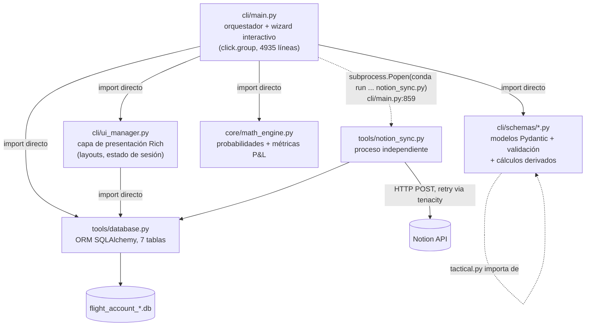
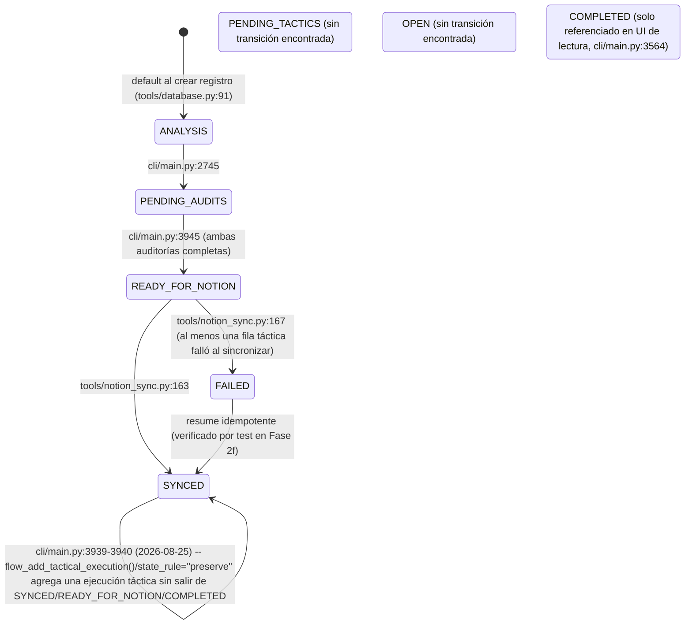

# ARCHITECTURE.md — blast_master

> Generado en Fase 3 de un research de arquitectura de 3 fases (Fase 1: identidad de repo, Fase 2: verificación de 6 claims, Fase 3: este documento). Cada hallazgo no trivial lleva `[VERIFICADO]` (con comando/línea citada) o `[NO VERIFICADO — hipótesis]`. Ver historial de conversación para el output crudo de cada comando — aquí se cita la conclusión y la ubicación, no se repite el output completo.

## 1. Resumen ejecutivo

**Qué es:** `blast_master` (B.L.A.S.T) es un CLI interactivo de trading journal (Python + Click + Rich) para registrar, auditar y sincronizar operaciones de trading contra Notion. Opera sobre múltiples cuentas/activos, cada una con su propia base de datos SQLite (`flight_account_{cuenta}_{activo}.db`), y calcula un "edge" direccional (`calc_edge`) que alimenta un modelo de probabilidades (long/short/no-trade).

**Identidad de repo resuelta (Fase 1):** de las 3 descripciones previas incompatibles (A: esquema plano single-DB con `risk_tier`; B: multi-DB por cuenta con campos `gates_failed`/`entry_time`/etc.; C: esquema normalizado de 7 tablas), la evidencia real es **"A muerta, B+C conviven"**: `risk_tier` tiene 0 ocurrencias en todo el código `[VERIFICADO]`; el nombrado multi-DB de (B) y el esquema de 7 tablas de (C) son ambos ciertos simultáneamente sobre el mismo objeto — (B) describe la capa de nombrado de archivo, (C) describe el esquema interno de tablas.

**Hallazgos clave verificados (detalle completo en §9):**
- La fórmula del "edge score" (`i_cd`) está duplicada carácter-por-carácter en **3 sitios** de `cli/main.py` (no 2, no 4) — uno de ellos autoetiquetado `# Defect 3` en su propio comentario.
- Un notebook (`jupyter/iterations.ipynb`) ejecutó un `DROP TABLE` destructivo sobre la DB de producción el 27-jul-2026 (mismo commit que "Fase 9: reestructuración tras haber borrado la base de datos"); la reinyección del backup falló por un placeholder sin reemplazar. Comparación de conteos contra el backup pre-incidente no muestra pérdida neta de filas, pero no se hizo diff fila-por-fila.
- Dos clases ORM (`AssetBalance`, `EmotionCatalog`) están definidas y no se usan en ningún otro punto del código.
- Existe una ruta hardcodeada developer-specific (`/mnt/c/Users/jcifu/Downloads`) en `cli/main.py:484`.
- 3 de los 8 estados declarados en `LifecycleState` no tienen transición de escritura confirmada en el código.
- Variables de entorno reales usadas por el motor de probabilidades (`ICD_NO_TRADE_MAX/MIN`, `ICD_EDGE_CAP`) no están documentadas en `.env.template`; una variable sí documentada (`TACTICAL_SCALING_FACTOR`) no se lee en ningún sitio.

## 2. Visión general de la arquitectura



`[VERIFICADO]` La dependencia es unidireccional: `cli/main.py:50` importa `cli.ui_manager`; `cli/ui_manager.py` (líneas 1-15) no importa `cli.main` ni `cli.schemas`, solo `tools.database` y `rich`. `cli/main.py:859` invoca `tools/notion_sync.py` como **proceso de sistema operativo separado** (`subprocess.Popen(["conda","run","-n","blast_master","env","PYTHONPATH=.","python","tools/notion_sync.py"], env=env_context)`), no como import de Python — es decir, el sync a Notion no corre en el mismo proceso que el wizard.

**Corrección respecto al esquema propuesto originalmente** (`cli/main.py → cli/ui_manager.py → cli/schemas/*.py → tools/database.py → tools/notion_sync.py` como cadena lineal): la evidencia muestra un patrón hub-and-spoke, no una cadena — `cli/main.py` importa directamente los 4 módulos (`ui_manager`, `schemas`, `math_engine`, `database`), y `ui_manager` importa `database` de forma independiente, no a través de `schemas`.

## 3. Estructura de directorios

```
blast_master/
├── cli/                        CLI principal (Click + Rich)
│   ├── main.py                 Entrypoint, wizard interactivo, todos los flows (4935 líneas)
│   ├── ui_manager.py            Layouts Rich, estado de sesión (CLIState), tablas de progreso
│   └── schemas/                 Modelos Pydantic (validación + cálculos derivados)
│       ├── efficiency.py        Direction/Strength enums, EfficiencyAnalysis
│       ├── tactical.py          Hierarchy/Timeframe enums, TacticalAnalysis
│       ├── audit_efficiency.py  Enums de auditoría de eficiencia, EfficiencyAudit
│       └── audit_tactical.py    16 enums de auditoría táctica (incl. TierSetup), TacticalAudit
├── config/                     Config estática versionada (Fase 1, feature "order_quantification")
│   ├── __init__.py             Marca de paquete (permite `import config.contract_specs`)
│   └── contract_specs.py       `CONTRACT_SPECS` (contract_size por símbolo + confianza) + `SYMBOL_ALIASES` (ver §12)
├── core/
│   └── math_engine.py           calculate_probabilities, calculate_algebraic_metrics (Fase 2b: param `contract_size`)
├── tools/
│   ├── database.py              ORM SQLAlchemy: LifecycleState + 7 tablas + helpers
│   ├── notion_sync.py           Sync a Notion (proceso separado), payloads + retry
│   ├── notion_handshake.py      Script standalone de diagnóstico de conexión (sin uso por otros .py)
│   ├── pnl_calculator.py        Conversión precio→dinero aislada: `resolve_spec`/`leg_usd`/`quantify` (Decimal, sin rich, sin red) — única fuente de la aritmética de `risk_usd`/`notional_size_usd` post-Fase 2
│   ├── derive_contract_multiplier.py  Bootstrap stdlib (csv + zipfile/xml para xlsx): segmenta el reporte MT5 en 4 secciones y deriva `contract_size` por símbolo; genera el bloque `CONTRACT_SPECS`
│   ├── match_historical_trades.py  Track B Paso 1 (solo lectura): cruza filas `order_filled=1` contra la sección Positions del reporte MT5 → `candidatos_size.csv`; `--validate-reviewed` y `--verify-closing`
│   ├── apply_historical_size_migration.py  Track B Paso 3 (ESCRIBE): backfillea `size` real + trazabilidad + `risk_usd` condicional; backup previo + `--confirm`/`--i-understand-this-is-production` (ejecutada 2026-09-03)
│   ├── migration_data/          Reportes MT5 reales + CSVs de migración — **gitignored** (data financiera)
│   ├── migrate_keff_v2.py       Script de migración manual (recalcula probabilidades)
│   ├── migrate_tactical_legacy.py  Script de migración manual (backfill gates_failed)
│   └── migrate_tactical_audit_1n.py  Script de migración manual (nuevo, sin trackear en git al 2026-08-25) — reconstruye `tactical_audit` para el cambio 1:1→1:many (ver §5). NO ejecutado todavía contra ninguna DB real.
├── jupyter/
│   ├── iterations.ipynb         Contiene el DDL destructivo verificado en Fase 2c
│   └── data_analysis.ipynb      Sin hallazgos relevantes verificados
├── tests/                       Suite pytest (9 archivos, incl. test_notion_sync.py)
├── scratch/                     Scripts/tests exploratorios no productivos (incl. test_sync_idempotency.py)
├── .data/                       DBs reales (gitignored, no versionadas — ver Fase 1)
├── .env.template                Plantilla de variables de entorno (ver §8, incompleta)
├── requirements.txt              Dependencias (ver §7)
├── gemini.md                     Documentación previa — confirmada obsoleta en Fase 1, no editada en esta tarea
├── task_plan.md / findings.md / progress.md / tests.md   Scaffolding de un esfuerzo B.L.A.S.T. anterior, en su mayoría vacíos, sin relación con el esquema de este documento
└── rewrite_main.py / fix_legacy.py / fix_nb.py / scratch_script.py / test_table.py  Scripts sueltos en la raíz, sin explorar en este research
```

`[NO VERIFICADO — hipótesis]` El propósito exacto de `rewrite_main.py`, `fix_legacy.py`, `fix_nb.py`, `scratch_script.py` y `test_table.py` no se investigó en Fase 1/2 — `rewrite_main.py` apareció en los greps de Fase 2 (contiene lógica de gates casi idéntica a `cli/main.py`, posible fork/borrador), el resto no se abrió.

## 4. Documentación módulo por módulo

### `cli/main.py` (4935 líneas) — orquestador principal
- `cli()` — `cli/main.py:797` — `@click.group()`, entrypoint real (`if __name__=="__main__": cli()` en `cli/main.py:4935`). Ejecuta `get_active_engine()` incondicionalmente en su callback.
- `get_active_engine()` — `cli/main.py:251` — resuelve el engine SQLAlchemy activo; contiene el guard de migración `journal.db → flight_account_001_xauusd.db` en `cli/main.py:263-268` (hardcodeado a esa cuenta específica, ver §9).
- `FlightSessionManager` — `cli/main.py:288` — gestiona sesiones por cuenta en un JSON (`FLIGHT_SESSIONS_FILE`); `create_session()` construye el nombre de DB con el patrón `flight_account_{account_index}_{sanitized_nickname}.db`.
- `AuditSession` — `cli/main.py:96`, `AnalysisSession` — `cli/main.py:200` — estado de wizard en memoria.
- `determine_market_bias(i_cd)` — `cli/main.py:620` — clasifica `i_cd` en Bullish/Bearish/Choppy.
- `flow_flight_sessions()` — `cli/main.py:700` — selección/creación de cuenta al arrancar.
- `start()` — `cli/main.py:802` — `@cli.command()`, menú principal.
- `flow_review_analysis()` — `cli/main.py:935` — revisión de análisis existentes.
- `flow_new_analysis()` — `cli/main.py:2346` — wizard de nueva operación. Al terminar de guardar (`:2808-2832`, actualización 2026-08-25) pregunta si se quiere alimentar un Tactical Audit de una vez, saltando directo a `flow_pending_audits()` con parámetros `preselected_*`.
- `flow_pending_audits()` — `cli/main.py:2948` — wizard de auditorías pendientes. Actualización 2026-08-25: ganó `preselected_trade_id`/`preselected_payload`/`preselected_choice`/`state_rule`/`force_new_tactical` para que tanto el prompt de `flow_new_analysis()` como `flow_add_tactical_execution()` puedan reusarlo sin pasar por el picker de `PENDING_AUDITS`; `state_rule="preserve"` evita degradar un registro que ya llegó a `READY_FOR_NOTION`/`SYNCED`/`COMPLETED`.
- `flow_add_tactical_execution()` — `cli/main.py:3954` — **nueva (2026-08-25)**, opción "7" del menú principal (`cli/ui_manager.py:213`). Agrega una ejecución táctica a cualquier análisis pasado, sin importar su estado actual.
- `render_final_review_layout()` — `cli/main.py:4025`.
- `flow_assets_configuration()` — `cli/main.py:4334`, `flow_add_whitelisted_asset()` — `cli/main.py:4403`.
- `flow_repair_analysis_audits()` — `cli/main.py:4432` — actualización 2026-08-25: si el análisis tiene 2+ filas `tactical_audit`, pregunta cuál ejecución reparar (`:4521-4533`) antes de mostrar el menú de edición.

`[NO VERIFICADO — hipótesis]` Los números de línea de este documento fueron verificados en la fecha de cada actualización citada; el resto de la sección (fórmula `i_cd` duplicada en 3 sitios, `cli()`/`get_active_engine()`/etc.) no se re-verificó al escribir esta actualización — el archivo creció de 4935 a 5954 líneas desde la última pasada de verificación completa, así que cualquier línea sin fecha de actualización explícita puede haber corrido.

### `cli/ui_manager.py` — capa de presentación
- `CLIState` — `cli/main.py` → `cli/ui_manager.py:143` — estado de UI persistente.
- `build_persistent_layout()` — `:166`, `render_wizard_layout()` — `:403`, `render_pending_audits_table()` — `:340`.
- `get_latest_analysis_record()` — `:364`, `has_paused_state()` — `:26`, `check_daemon_status()` — `:124`.
- Depende únicamente de `tools.database` (import directo, línea 15) — no de `cli.schemas` ni `core.math_engine`.

### `cli/schemas/efficiency.py`
- `Direction(str, Enum)` — `:5` (`LONG`/`SHORT`/`NEUTRAL`), `Strength(str, Enum)` — `:10` (`STRONG`/`MID`/`WEAK`).
- `AnalysisLayerInput(BaseModel)` — `:15`, `EfficiencyAnalysis(BaseModel)` — `:22` con `calculate_derived_fields()` — `:41` (lee `EFFICIENCY_SCALING_FACTOR`/`NO_TRADE_BASE_EXPONENT` del entorno).

### `cli/schemas/tactical.py`
- Importa `Direction`/`Strength`/`AnalysisLayerInput` de `cli.schemas.efficiency` (línea 4) — único acoplamiento cruzado entre archivos de `schemas/`.
- `TacticalAnalysis(BaseModel)` — `:43`, `calculate_derived_tactics()` — `:65` (llama a `core.math_engine.calculate_probabilities`, línea 70), `to_db_layers()` — `:77`.

### `cli/schemas/audit_efficiency.py`
- 4 enums (`StructuralBias`, `ResolutionType`, `StructuralResolution`, `FailureReason`), `EfficiencyAudit(BaseModel)` — `:35` con `calculate_audit_metrics()` — `:53`.

### `cli/schemas/audit_tactical.py` (el schema más grande — 255+ líneas)
- 16 enums, incluyendo `TierSetup(str, Enum)` — `:13` con valores reales `A, B, C, D, F, SKIP` — **sin valor "E"** (ver §9/§10).
- `TacticalAudit(BaseModel)` — `:164`, `calculate_automated_fields()` — `:255`. `[NO VERIFICADO — hipótesis]` no se leyó el cuerpo completo de esta función; es candidata a ser donde se calculan `gates_failed`/`confirmations_count` a nivel Python (en paralelo a las columnas `GENERATED ALWAYS AS VIRTUAL` que el notebook de Fase 2c intentó introducir).

### `core/math_engine.py`
- `Probabilities(NamedTuple)` — `:13`.
- `calculate_probabilities(calc_edge)` — `:18` — único punto de cálculo de probabilidades del sistema (Fase 2a). Lee `ICD_NO_TRADE_MAX`/`ICD_NO_TRADE_MIN`/`ICD_EDGE_CAP` del entorno (líneas 23-25, no documentadas en `.env.template`).
- `calculate_algebraic_metrics()` — `:62` — P&L, R:R, capital en riesgo. Comentario propio en línea 61: `# Funciones heredadas (No modificar)`.

### `tools/database.py`
- `LifecycleState(str, Enum)` — `:10` — 8 valores (ver §5/§9 para cuáles tienen transición verificada).
- `Base(DeclarativeBase)` — `:47`, y 7 clases ORM: `AssetBalance` `:51`, `EmotionCatalog` `:58`, `AssetConfig` `:63`, `AnalysisLayer` `:73`, `UnifiedDepartment` `:87`, `EfficiencyAudit` `:122`, `TacticalAudit` `:142`.
- `init_db(db_url="sqlite:///.data/flight_account_001_xauusd.db")` — `:227` — nótese el default hardcodeado a la cuenta 001, mismo patrón que el guard de migración de `cli/main.py`.
- `update_record_state()` — `:413` — único setter genérico de `LifecycleState`. Actualización 2026-08-25: ganó el parámetro `tactical_audit_id` (edita una fila táctica específica en vez de siempre insertar una nueva) — ya **no** tiene un único call site, `cli/main.py` lo invoca tanto desde `flow_pending_audits()` como (indirectamente, vía ese mismo flujo) desde `flow_new_analysis()` y `flow_add_tactical_execution()`.
- `get_records_by_state()` — `:514` — mantiene su contrato de "un payload por análisis" tras la actualización 2026-08-25: toma deliberadamente solo la fila táctica más reciente, no enumera todas las ejecuciones (documentado en su propio código). `get_assets()` — `:385`, `add_asset()` — `:390`.
- `get_tactical_audit_sync_targets()` — `:627` — **nueva (2026-08-25)**. Un dict por `(unified_department, tactical_audit)` sin `notion_page_id`, incluyendo ejecuciones agregadas a un análisis ya `SYNCED` — la usa la segunda pasada de `tools/notion_sync.py:sync_records()`.

### `tools/notion_sync.py`
- `NotionAPIError`/`RateLimitError` — `:20`/`:23`.
- `map_efficiency_payload()` — `:34`, `map_tactical_payload()` — `:58`.
- `post_to_notion()` — `:80` — con retry vía `tenacity` (verificado por test en Fase 2f).
- `sync_records()` — `:95` — actualización 2026-08-25: ahora es de **dos pasadas**, no una. Pasada 1 (`:109-180`): analises `READY_FOR_NOTION`/`FAILED` — crea la página Efficiency solo si no existe, y sincroniza cada fila `tactical_audit` sin `notion_page_id` de forma independiente; solo promueve a `SYNCED` (`:163`) si **todas** las filas quedaron sincronizadas, si no `FAILED` (`:167`). Pasada 2 (`:182-202`): usa `get_tactical_audit_sync_targets()` (`tools/database.py:627`) para sincronizar ejecuciones agregadas después a un análisis que ya estaba `SYNCED`, sin recrear ni tocar la página Efficiency.
- Bug encontrado y arreglado 2026-08-25 (preexistente, sin relación con el cambio 1:many): `map_tactical_payload()` (`:62`) pasaba `calc_edge` (columna `Numeric`, se lee como `Decimal`) directo al JSON sin convertir — cualquier sync de un Tactical Audit habría fallado con `TypeError: Object of type Decimal is not JSON serializable`. Arreglado con `safe_float()`, igual que ya hacía el payload de Efficiency. Nunca antes tuvo cobertura de test que lo detectara — `sync_records()` en sí no tenía ningún test hasta `tests/test_notion_sync_two_pass.py` (2026-08-25).
- Se ejecuta como **proceso separado** (ver §2), no como import directo desde `cli/main.py` en producción (sí se importa directamente en tests, ej. `scratch/test_sync_idempotency.py:10`).

### `tools/notion_handshake.py`
- `verify_notion_connection()` — `:8` — lee `NOTION_API_KEY`/`NOTION_DATABASE_ID`. `[VERIFICADO]` cero referencias a este archivo desde cualquier otro `.py` del proyecto — script standalone de diagnóstico manual, no integrado al flujo del CLI.

### `tools/migrate_keff_v2.py` / `tools/migrate_tactical_legacy.py`
- Scripts de migración con `main()` propio (`:98` y `:15` respectivamente), invocados manualmente (no importados por `cli/main.py`). `migrate_keff_v2.py` recalcula `long_prob`/`short_prob`/`no_trade_prob` reutilizando `core.math_engine.calculate_probabilities` (comentario explícito: "Fuente única de verdad").

## 5. Modelo de datos

### Diagrama ER (7 tablas reales, confirmado por `.schema` en Fase 1)

> **Actualización 2026-08-12 (retiro de `compliance`/`trade_status`):** `unified_department.trade_status` y `tactical_audit.compliance` fueron eliminados de las 3 DBs de cuenta (DROP COLUMN, con backup previo) y del código. Ambos eran señales de ejecución redundantes/potencialmente divergentes de la realidad (`trade_status` era informativo puro sin uso analítico; `compliance` alimentaba el motor de KPIs pero mezclaba "¿se llenó la orden?" con un juicio subjetivo de calidad de ejecución). `tactical_audit.order_filled` (booleano) es ahora la única señal de ejecución, derivada al momento de guardar la auditoría táctica y usada como gate binario en `core/analytics_engine.py:filter_executed_trades` y `core/backtest_engine.py:reconstruct_execution_outcome` (este último usa el signo de `r_multiple`, no una etiqueta manual, para el acierto direccional). `efficiency_audit.specific_bias_compliance` no fue tocado — sigue siendo un campo distinto (validez del sesgo estructural, no de ejecución).

> **Actualización 2026-08-25 (`tactical_audit` 1:1 → 1:many) — comiteado en `ece30b3`, migración ya aplicada a las 3 DBs reales.** `TacticalAudit.id` dejó de ser la PK compartida con `unified_department.id` (`tools/database.py:159`, antes `ForeignKey(..., primary_key=True)`) y pasó a ser un UUID propio; el vínculo con el análisis ahora es `trade_id` (`:160`, FK normal no-única, mismo patrón que `AnalysisLayer.trade_id`), permitiendo varias ejecuciones reales por análisis (escalar el mismo edge, retomarlo días después) sin crear un nuevo Unified Analysis cada vez. `efficiency_audit` no se tocó — sigue 1:1. Nuevas columnas en `TacticalAudit`: `created_at`/`updated_at`/`notion_page_id` (`:161-163`); `UnifiedDepartment.tactical_page_id` se eliminó (su valor se traslada al `notion_page_id` de la primera fila durante la migración). El diagrama ER de abajo ya refleja el esquema nuevo — las 3 DBs reales (`.data/flight_account_*.db`) ya lo tienen aplicado con autorización explícita del usuario (`tools/migrate_tactical_audit_1n.py --confirm --i-understand-this-is-production`, verificado: conteos sin cambio, 0 filas con `trade_id` huérfano en las 3 cuentas). Backup previo: snapshot manual por `VACUUM INTO` en `.data/archives/pre_tactical_audit_1n_<cuenta>_20260825_085521.db` (`tools/backup.py` no se pudo usar — sin USB montado ni credenciales B2 en este entorno). Detalle completo (CLI, Notion sync de dos pasadas, `report_data.py`, tests, notebooks) en "Antes de tocar código en este repo" de `CLAUDE.md`; diseño original en `/home/jorgecg/.claude/plans/actualmente-quiero-que-hagamos-robust-giraffe.md`. El código que acompaña la migración ya está integrado a la rama principal (`ece30b3`).

```mermaid
erDiagram
    UNIFIED_DEPARTMENT ||--o{ ANALYSIS_LAYER : "trade_id → id, CASCADE"
    UNIFIED_DEPARTMENT ||--o| EFFICIENCY_AUDIT : "id → id (PK compartida), CASCADE"
    UNIFIED_DEPARTMENT ||--o{ TACTICAL_AUDIT : "trade_id → id, CASCADE"

    UNIFIED_DEPARTMENT {
        varchar id PK
        varchar state
        varchar asset
        float calc_edge
        float long_prob
        float short_prob
        float no_trade_prob
    }
    ANALYSIS_LAYER {
        varchar id PK
        varchar trade_id FK
        varchar layer_name
        varchar direction
        int score
    }
    EFFICIENCY_AUDIT {
        varchar id PK_FK
        varchar bias_a
        varchar real_bias_b
        varchar resolution_type
    }
    TACTICAL_AUDIT {
        varchar id PK
        varchar trade_id FK
        datetime created_at
        datetime updated_at
        varchar notion_page_id
        varchar tier_setup
        boolean order_filled
        int gates_failed
        int confirmations_count
        datetime entry_time
        float entry_price
        float closing_price
        varchar setup_type
    }
    ASSET_CONFIG {
        int id PK
        varchar asset_name
        varchar code
    }
    ASSET_BALANCE {
        varchar asset_code PK
    }
    EMOTION_CATALOG {
        int emotion_id PK
    }
```

`[VERIFICADO]` `ASSET_CONFIG`, `ASSET_BALANCE` y `EMOTION_CATALOG` **no tienen FK hacia `UNIFIED_DEPARTMENT`** en el `.schema` real — son tablas standalone. `ASSET_BALANCE`/`EMOTION_CATALOG` además no tienen ninguna clase ORM referenciada fuera de su propia definición (Fase 2d) — probablemente vestigiales. `ASSET_CONFIG` sí se usa activamente vía `get_assets()`/`add_asset()` (whitelist de activos).

### Diagrama de estados — `LifecycleState`



`[VERIFICADO]` Solo 5 de los 8 valores declarados (`ANALYSIS`, `PENDING_AUDITS`, `READY_FOR_NOTION`, `SYNCED`, `FAILED`) tienen un punto de escritura real localizado por grep dirigido (`LifecycleState.X.value` y comparación de string literal). `[NO VERIFICADO — hipótesis]` `PENDING_TACTICS`/`OPEN`/`COMPLETED` podrían asignarse dinámicamente (construcción de string no cubierta por el patrón de grep usado) — no se puede afirmar con certeza que sean código muerto, solo que no se encontró evidencia de asignación.

## 6. Flujo de datos end-to-end

1. Usuario arranca `cli()` → `get_active_engine()` resuelve/crea la DB de la sesión activa (`FlightSessionManager`).
2. `flow_new_analysis()` (`cli/main.py:2346`) recolecta inputs direccionales (`p0`...`p4`) → calcula `i_cd` in-line (fórmula duplicada, sitio #1 o #2 según el punto del wizard) → `determine_market_bias(i_cd)` + `core.math_engine.calculate_probabilities(i_cd)`.
3. Los datos se validan/enriquecen vía `cli/schemas/tactical.py` (`TacticalAnalysis.calculate_derived_tactics()`, que **sí** reutiliza `calculate_probabilities` como función compartida, a diferencia del cálculo de `i_cd`) y `cli/schemas/efficiency.py`.
4. Persistencia inicial vía `tools/database.py`: se crea `UnifiedDepartment` (estado inicial `ANALYSIS`, transiciona a `PENDING_AUDITS` en el mismo flujo) + filas `AnalysisLayer` asociadas.
5. **Actualización 2026-08-25:** justo después de guardar, `flow_new_analysis()` pregunta si se quiere alimentar un Tactical Audit de una vez (`:2808-2832`) — si el usuario acepta, salta directo al paso 6 para ese mismo registro sin volver al menú.
6. `flow_pending_audits()` (`cli/main.py:2948`) recolecta las auditorías de eficiencia/táctica (`EfficiencyAudit`/`TacticalAudit`, con su propio recálculo de `i_cd` — sitio #3, `recalculate_unified_metrics`) → al completarse ambas, `update_record_state()` promueve `PENDING_AUDITS → READY_FOR_NOTION`. Desde 2026-08-25, `tactical_audit` es 1:many (ver §5) — este mismo flujo, reinvocado más tarde vía la nueva `flow_add_tactical_execution()` (`:3954`) sobre un análisis que ya llegó a `READY_FOR_NOTION`/`SYNCED`/`COMPLETED`, agrega una ejecución adicional sin degradar ese estado (`state_rule="preserve"`).
7. El usuario (u otro disparador manual) invoca la sincronización → `cli/main.py:859` lanza `tools/notion_sync.py` como **proceso de sistema operativo separado** (`subprocess.Popen`), no una llamada de función in-process.
8. `sync_records()` (actualización 2026-08-25: dos pasadas, ver §4) lee registros en `READY_FOR_NOTION`/`FAILED`, arma payloads (`map_efficiency_payload`/`map_tactical_payload`) y hace `POST` a la API de Notion (`post_to_notion`, con retry vía `tenacity`) una vez por cada fila `tactical_audit` sin sincronizar → estado final `SYNCED` o `FAILED` (con posibilidad de resume idempotente, verificado en Fase 2f). Una segunda pasada cubre ejecuciones agregadas después a un análisis ya `SYNCED` (paso 6), sin reabrir ni recrear su página Efficiency.

`[VERIFICADO]` cada paso cita archivo:línea arriba (pasos 1-4, 7 re-verificados solo donde el número de línea cambió; pasos 5-6-8 verificados en la actualización 2026-08-25). `[NO VERIFICADO — hipótesis]` qué dispara el paso 7 en la práctica (¿comando manual del usuario, cron, o botón en el wizard?) — no se rastreó el disparador exacto de esa línea de `subprocess.Popen`.

## 7. Dependencias externas

| Paquete | Versión | Uso real verificado |
|---|---|---|
| `requests` | 2.31.0 | HTTP a Notion API (`tools/notion_sync.py`, `tools/notion_handshake.py`) `[VERIFICADO]` |
| `rich` | 13.7.1 | Toda la capa de presentación (`Panel`/`Table`/`Layout`/`Console`) en `cli/main.py` y `cli/ui_manager.py` `[VERIFICADO]` |
| `python-dotenv` | 1.0.1 | `load_dotenv()` en `core/math_engine.py:9` `[VERIFICADO]` |
| `pydantic` | 2.6.3 | `BaseModel` en los 4 archivos de `cli/schemas/` `[VERIFICADO]` |
| `pytest` | 8.0.2 | Suite `tests/` (9 archivos) `[VERIFICADO]` |
| `sqlalchemy` | 2.0.27 | ORM completo, `tools/database.py` `[VERIFICADO]` |
| `click` | 8.1.7 | `@click.group()`/`@cli.command()`, `cli/main.py` `[VERIFICADO]` |
| `tenacity` | 8.2.3 | Retry de `post_to_notion` (`tools/notion_sync.py`), probado en `tests/test_notion_sync.py:test_rate_limit_backoff` `[VERIFICADO]` |
| `requests-mock` | 1.11.0 | Mocking HTTP en `tests/test_notion_sync.py` y `scratch/test_sync_idempotency.py` `[VERIFICADO]` |
| `InquirerPy` | 0.3.4 | Prompts interactivos, usado en `cli/main.py` (y `scratch/test_keys.py`, `scratch/test_c_r.py`) `[VERIFICADO]` |

## 8. Configuración y variables de entorno

| Variable | Declarada en `.env.template` | Leída en código | Estado |
|---|---|---|---|
| `NOTION_API_KEY` | Sí | `tools/notion_handshake.py:11`, `tools/notion_sync.py:10` | `[VERIFICADO]` OK |
| `NOTION_DATABASE_ID` | Sí | `tools/notion_handshake.py:12`; fallback en `tools/notion_sync.py:11-12` | `[VERIFICADO]` OK |
| `EFFICIENCY_SCALING_FACTOR` | Sí (`0.2833`) | `cli/schemas/efficiency.py:45` | `[VERIFICADO]` OK |
| `NO_TRADE_BASE_EXPONENT` | Sí (`1.54`) | `cli/schemas/efficiency.py:46` | `[VERIFICADO]` OK |
| `TACTICAL_SCALING_FACTOR` | Sí | **0 ocurrencias en `os.getenv`/`os.environ` en todo el árbol `.py`** | `[VERIFICADO]` variable muerta — declarada, nunca leída |
| `ICD_NO_TRADE_MAX` | **No** | `core/math_engine.py:23` (default fallback `0.8000`) | `[VERIFICADO]` indocumentada — calibra el modelo de probabilidades real |
| `ICD_NO_TRADE_MIN` | **No** | `core/math_engine.py:24` (default fallback `0.5000`) | `[VERIFICADO]` indocumentada |
| `ICD_EDGE_CAP` | **No** | `core/math_engine.py:25` (default fallback `1.0000`) | `[VERIFICADO]` indocumentada |
| `EFFICIENCY_DB_ID` | **No** | `tools/notion_sync.py:11` (fallback a `NOTION_DATABASE_ID`) | `[VERIFICADO]` indocumentada |
| `TACTICAL_DB_ID` | **No** | `tools/notion_sync.py:12` (fallback a `NOTION_DATABASE_ID`) | `[VERIFICADO]` indocumentada |

## 9. Hallazgos arquitectónicos y deuda técnica

### Los 6 claims de Fase 2 (aprobados, con correcciones incorporadas)

**(a) ¿2 modelos de probabilidad distintos?** `[VERIFICADO]` — **Refutado.** Solo existe 1: `core/math_engine.py:18 calculate_probabilities()`. Se persiste su único resultado vía `tools/database.py:109-111`. Llamado consistentemente desde `cli/schemas/tactical.py:70`, `cli/main.py:2103`, `cli/main.py:3982`, `tools/migrate_keff_v2.py:138`.

**(b) ¿Fórmula del Edge Score duplicada, en cuántos sitios?** `[VERIFICADO]` — **3 sitios exactos** (no 2, no 4): `cli/main.py:2091-2100`, `cli/main.py:2187-2196`, `cli/main.py:3963-3972`. El tercero es una variante (comparación por strings literales en vez de enums) autoetiquetada `# Multi-Layer Recalculation Pipeline (Defect 3)` en su propio comentario (línea 3961).

**(c) ¿DDL destructivo sin ejecutar?** `[VERIFICADO]` — **Al revés de la premisa: sí se ejecutó.** `jupyter/iterations.ipynb` celda índice 3 (`execution_count=6`) ejecutó `DROP TABLE IF EXISTS tactical_audit` + `CREATE TABLE` con columnas `GENERATED ALWAYS AS VIRTUAL` y `CHECK` constraint contra la ruta absoluta de producción — con éxito (stdout confirmado). La reinyección posterior de datos de backup falló (`ValueError: Expected object or value`, placeholder JSON nunca reemplazado). Correlación temporal exacta (mismo segundo) con el commit `c60e32c` ("Fase 9... tras haber borrado la base de datos", 2026-07-27 12:01:54). Comparación de conteos backup pre-incidente (18-jul: `tactical_audit`=36, `unified_department`=37) vs. actual (58/58) **no muestra pérdida neta** — criterio de cierre acordado con el usuario, sin diff fila-por-fila por clave de negocio (limitación anotada explícitamente, no resuelta).

> **Actualización de estado (08-ago-2026):** la celda con `DROP TABLE IF EXISTS tactical_audit` fue eliminada de `jupyter/iterations.ipynb` (verificado por diff: 157 líneas removidas, 0 agregadas — borrado limpio de la celda, no una edición). El hallazgo forense de arriba se conserva sin cambios como registro histórico del incidente; esta nota solo documenta que el riesgo de re-ejecución ya no existe en el árbol de trabajo actual.

**(d) ¿Tablas ORM sin uso?** `[VERIFICADO]` — `AssetBalance` (`tools/database.py:51`) y `EmotionCatalog` (`tools/database.py:58`): cero referencias fuera de su propia definición en todo el árbol `.py`.

**(e) ¿Ruta hardcodeada developer-specific?** `[VERIFICADO]` — `cli/main.py:484`: `Path("/mnt/c/Users/jcifu/Downloads")`. Adicional: `jupyter/iterations.ipynb` también hardcodea la ruta absoluta completa del repo (fuera del alcance del grep `.py` original).

**(f) Diff scratch/test_sync_idempotency.py vs tests/test_notion_sync.py** `[VERIFICADO]` — Cero solapamiento. `tests/test_notion_sync.py`: 2 tests unitarios sobre `post_to_notion` (rate-limit backoff, POST exitoso). `scratch/test_sync_idempotency.py`: 1 test de integración (DB en memoria) que cubre fallo parcial + resume idempotente de `sync_records()`.

### Hallazgos adicionales surgidos durante la redacción de Fase 3

*(No pasaron por el gate de aprobación de Fase 2 — presentados aquí para tu revisión, no como conclusiones ya aprobadas.)*

**(g) Estados de `LifecycleState` sin transición verificada.** `[VERIFICADO el patrón de no-uso vía grep dirigido]` — 3 de 8 valores (`PENDING_TACTICS`, `OPEN`, `COMPLETED`) declarados en `tools/database.py:10-17` sin punto de escritura confirmado. `COMPLETED` aparece en una condición de estilo de solo-lectura (`cli/main.py:3564`). `[NO VERIFICADO — hipótesis]` que sea código muerto — el grep no cubre construcción dinámica de strings.

**(h) Variables de entorno indocumentadas o muertas.** `[VERIFICADO]` — ver tabla completa en §8. `TACTICAL_SCALING_FACTOR` se declara y no se lee; `ICD_NO_TRADE_MAX`/`ICD_NO_TRADE_MIN`/`ICD_EDGE_CAP` (las constantes reales del modelo de probabilidades) y `EFFICIENCY_DB_ID`/`TACTICAL_DB_ID` se leen y no se declaran.

**(i) `TierSetup` real es A-D+F, no A-F.** `[VERIFICADO]` — `cli/schemas/audit_tactical.py:13-19`: valores `A, B, C, D, F, SKIP`. No existe nivel "E" — corrige la descripción previa que asumía un rango continuo "A-F".

**(j) `tools/notion_handshake.py` no está integrado al flujo del CLI.** `[VERIFICADO]` — cero referencias desde cualquier otro `.py` del proyecto. Script standalone de diagnóstico manual.

## 10. Glosario de dominio

- **`I_CD` / Edge Score / `calc_edge`** — Promedio ponderado de 5 señales direccionales (`x0`...`x4`, pesos `0.30/0.25/0.15/0.10/0.20`, dividido entre 2) que representa la ventaja/sesgo direccional estimado de una operación. Determina `market_bias` (Bullish/Bearish/Choppy) y alimenta `calculate_probabilities`. `[VERIFICADO]` fórmula duplicada en 3 sitios, ver §9(b).
- **Gates / Confirmations (`gates_failed`/`confirmations_count`)** — Checklist pre-trade: 7 "gates" (`g1_trend_15m`...`g7_tp_validated`) son condiciones obligatorias; 8 "confirmations" (`c1_kl_support`...`c8_convergence_15m`) son señales de confluencia opcionales. `[VERIFICADO]` columnas confirmadas en el `.schema` real (Fase 1). `[NO VERIFICADO — hipótesis]` el mecanismo exacto de cálculo en Python (candidato: `cli/schemas/audit_tactical.py:255 calculate_automated_fields`) no se leyó línea por línea.
- **Tier Setup** — Clasificación de calidad de un setup de trading. Valores reales: `A, B, C, D, F, SKIP` (`cli/schemas/audit_tactical.py:13`) — sin nivel "E". `[VERIFICADO]`.
- **Flight Session** — Unidad de sesión operativa por cuenta, gestionada por `FlightSessionManager` (`cli/main.py:288`), que crea/nombra un archivo `.db` independiente por cuenta con el patrón `flight_account_{account_index}_{sanitized_nickname}.db`. `[VERIFICADO]`.
- **`LifecycleState`** — Máquina de estados del ciclo de vida de un trade (8 valores declarados, `tools/database.py:10-17`). Ver §5 para el diagrama y qué transiciones tienen evidencia real de escritura.

## 11. Migración histórica de `size` (Track B — feature "order_quantification")

Contexto: `tactical_audit.size` nunca contuvo un volumen de bróker real. `[VERIFICADO]` por `SELECT size, COUNT(*) FROM tactical_audit GROUP BY size` en las 3 DBs (2026-09-03): de 108 filas totales, `size` es `1`/`0`/`NULL` en 107 y `3` en 1. Ninguna fila tiene un lote real (ej. `0.01`). El Track B backfillea `size` (y, condicionalmente, `risk_usd`) para las filas `order_filled=1` cruzando contra el historial MT5 real (`tools/migration_data/ReportHistory-87050257.xlsx`, gitignored), vía `tools/match_historical_trades.py` (dry-run + CSV para revisión manual) y `tools/apply_historical_size_migration.py` (`--confirm`, con backup previo a `.data/archives/*.pre_migration_<ts>` y columnas de trazabilidad `size_source`/`size_match_confidence`/`size_migrated_at`).

Nota sobre `227f82c4-67a7-414b-8b4f-3280728ec6ab` (account_003, US100): es la única fila de las 108 migradas cuyo `size` original no era 1/0/NULL, sino 3. El significado original de ese valor no pudo confirmarse (George: "no lo recuerdo, pero es posible que lo haya escrito"). Se migró igual, al mismo valor 0.03 verificado por MT5 (open+close+dirección), porque el valor de bróker es evidencia independiente de mayor calidad que un campo sin explicación recuperable. El valor original (3) queda preservado en el backup `.data/archives/flight_account_003_us100.db.pre_migration_<ts>`.

## 12. Fase 2 — `risk_usd` / `notional_size_usd` con `contract_size`

**`config/contract_specs.py` — tabla estática y versionada de `contract_size` por símbolo** (derivada una vez con `tools/derive_contract_multiplier.py` contra `tools/migration_data/ReportHistory-87050257.xlsx`, sección Positions; `multiplier = Profit / (Volume·ΔPrecio)`, signo invertido para `sell*`). Regla de confianza: `n ≥ 30` y desviación relativa `< 0.1 %` → `VERIFICADO`.

| símbolo | `contract_size` | confianza | fuente | n |
|---|---|---|---|---|
| `XAUUSD` | `Decimal("100")` | `[VERIFICADO]` | `ReportHistory-87050257.xlsx · Positions` | 265 |
| `BTCUSD` | `None` | `[NO VERIFICADO]` | `ReportHistory-87050257.xlsx · Positions` | 5 |
| `NAS100` | `None` | `[NO VERIFICADO]` | `ReportHistory-87050257.xlsx · Positions` | 1 |

`SYMBOL_ALIASES` mapea los tickers reales de las DBs (`unified_department.asset`) a esas claves: `XAUUSDT.P → XAUUSD`, `BTCUSDT.P → BTCUSD`, `US100 → NAS100`. **`[NO VERIFICADO]` bloquea el cálculo** en `tools/pnl_calculator` (`resolve_spec`/`quantify` levantan `UnverifiedSymbolError`) y, por lo tanto, en el validator de `audit_tactical.py`, en el repair flow y en el cuadro de P&L del wizard (Fase 3) — se muestra `"N/A (símbolo no verificado)"` hasta confirmación manual del `contract_size` vía MT5 → clic derecho sobre el símbolo → *Specification*, y marcarlo `VERIFICADO` en el archivo. Ver §11/§12 para el historial de decisiones. `contract_size` es siempre un `Decimal` real o `None` — nunca un string ni un placeholder.

**`asset` en el modelo pydantic `TacticalAudit`** (`cli/schemas/audit_tactical.py`) — campo nuevo `asset: Optional[str] = None` (nullable; no rompe construcciones que aún no lo pasen). Poblado en los 4 sitios de construcción de `cli/main.py` (`flow_pending_audits`: ramas `no_trade`, `abort`, no-llenada y llenada) desde `payload.get("asset")` `[VERIFICADO]` — las 3 fuentes del `payload` (`get_records_by_state` → `tools/database.py:542`, `flow_add_tactical_execution` → `cli/main.py:4068`, `flow_new_analysis` post-save → `cli/main.py:2861`) siempre incluyen `"asset"`. NO es columna de `tactical_audit`; `update_record_state` la filtra fuera del dump — es transitoria, solo para el validator.

**Validator `calculate_automated_fields`** (`cli/schemas/audit_tactical.py`): `risk_usd` y `notional_size_usd` dejan de usar la aritmética propia y se calculan vía `tools/pnl_calculator.resolve_spec(self.asset)["contract_size"]` (= `|ep−sl|·size·contract_size` y `ep·size·contract_size`). Sin `asset`, o símbolo NO VERIFICADO / desconocido → ambos `None` + `logging.warning` (nunca bloquea el guardado del resto del `tactical_audit`). `notional_size` (sin `_usd`), `capital_at_risk` y los 3 campos off-limits (`structural_analysis` / `tactical_analysis` / `edge_score`) **no se tocan**.

**Fase 2b — EXCEPCIÓN puntual al límite de dominio de `core/math_engine.py`**, autorizada explícitamente por George, **acotada a la firma de `calculate_algebraic_metrics` y sus 2 líneas de `notional_size`/`notional_size_usd`** (`:99-101`). Se agregó el parámetro `contract_size=None`; las 2 líneas multiplican por `Decimal(str(contract_size)) if contract_size is not None else Decimal("1")` (default preserva el comportamiento previo para cualquier caller no tocado). Único caller vivo actualizado: `recalculate_tactical_math` (`cli/main.py`, repair flow) resuelve `contract_size` vía `pnl_calculator.resolve_spec(workspace["asset"])` y pasa `None` + `logging.warning` si el símbolo no está VERIFICADO. `tools/backfill_r_multiple.py:198` **no se tocó** (confirmado: nunca persiste `notional_size`/`notional_size_usd` — solo escribe `r_multiple` y `captured_mfe` en `:227-228`). El resto de `core/math_engine.py` (`calculate_edge_score`, `calculate_probabilities`, `risk_usd`, `pnl`, `r_r`, `r_multiple`, etc.) sigue off-limits sin cambios.

**Asimetría CERRADA en su totalidad en Fase 2c (2026-09-03): `risk_usd`, `capital_at_risk` y `notional_size` — los tres `NULL` (no `×1` silencioso) cuando el símbolo no está verificado, tanto en memoria como en la fila persistida.** La excepción acotada a `core/math_engine.calculate_algebraic_metrics` se extendió (autorización explícita de George) a `risk_usd = dsize·sl_dist·_cs` y `capital_at_risk = dsize·(dep−dsl)·_cs` (rama Long + equivalentes Short); `notional_size`/`notional_size_usd` ya escalaban desde 2b. `recalculate_tactical_math` (repair flow, único caller vivo) ya resolvía `_cs` desde 2b; cuando `_cs is None` (símbolo NO VERIFICADO) pone `risk_usd`, `capital_at_risk` **y `notional_size`** en `None` en el `workspace` antes de persistir (no el valor sin `contract_size`). La lista de campos afectados vive en una sola constante, `cli/main.py:MONEY_FIELDS_REQUIRING_CONTRACT_SIZE = ("risk_usd", "capital_at_risk", "notional_size", "notional_size_usd")` — el bloque `if _cs is None` itera sobre ella (evita que un campo nuevo escalado por `contract_size` quede sin proteger, como pasó al principio con `notional_size_usd`). Los binds SQL crudos del `UPDATE`/`INSERT` (`float(workspace["…"]) if … is not None else None`) y ambas líneas del panel de review del repair flow (`Notional Size` / `Notional Size USD`) quedaron None-safe. Verificado contra las 29 filas migradas de Track B: lo que el repair flow escribiría ahora coincide con el valor ya correcto (XAU: `risk_usd`/`notional_size` con `contract_size=100`; BTC/US100: `None`), no con el `1/contract_size` ni la basura de antes de 2c. `tests/test_repair_analysis_audits.py::test_flow_repair_analysis_audits_unverified_symbol_persists_null_risk` corre el repair flow completo y lee la fila real de la DB por SQL crudo para confirmar `NULL` en la capa de persistencia, no solo en el dict de Python.

**Registro de excepciones puntuales a `core/math_engine.py:calculate_algebraic_metrics`** (único archivo off-limits que se tocó, siempre con autorización explícita de George, siempre acotado a líneas concretas):

| Fase | Fecha | Líneas | Cambio |
|---|---|---|---|
| 2b | 2026-09-03 | firma + `:99-101` (`notional_size`, `notional_size_usd`) | `+ param contract_size=None`; `× _cs` |
| 2c | 2026-09-03 | `:109-110` + `:115-116` (`capital_at_risk`, `risk_usd`, Long + Short) | `× _cs` |
| 2e | 2026-09-06 | `:111` + `:117` (`pnl`, Long + Short) | `× _cs` — `pnl_and_cost` (retorno `pnl - dcost`) escala en cascada |

Escalan por `contract_size`: `notional_size`, `notional_size_usd`, `capital_at_risk`, `risk_usd`, `pnl`, `pnl_and_cost`. **NO** escalan (son ratios / distancias): `r_r`, `r_multiple`, `dist_to_sl`, `dist_to_tp`, `captured_mfe`, `captured_mae`. El resto de `core/math_engine.py` (`calculate_edge_score`, `calculate_probabilities`) sigue off-limits sin cambios.

**Fase 2e** corrige el `PnL` que `show_unified_detail` calcula en vivo (`calculate_algebraic_metrics` ya recibía `contract_size` desde Fase 2d, pero la línea `pnl` no lo aplicaba) — mostraba `$0.29` en vez de `$29.00` para `a73ed0ca` (XAUUSDT.P, size 0.01). `cost` (`= pnl_recalculado − pnl_and_cost_persistido`) se corrige en cascada (era `−$28.71`, ahora `$0.00`). `pnl_and_cost` (columna persistida) no cambia — para las 24 filas XAUUSD migradas por Track B (todas `size=0.01`) el valor histórico ya coincide con el recálculo `× 100` por la identidad exacta `1 == 0.01 × 100` (verificado sobre 3 filas reales: si el repair flow re-guarda una, `pnl_and_cost` queda idéntico). Las 5 filas NO VERIFICADO (BTC ×4, US100 ×1) siguen con sus campos monetarios stale y `risk_usd` NULL — bloqueadas por verificación del símbolo, sin backfill pendiente para VERIFICADO.

**Efecto lateral corregido:** `cli/main.py` panel de review del wizard tac — la línea `"Notional Size USD:"` imprimía `audit_tactical.notional_size` (el campo sin `_usd`, bug preexistente); ahora imprime `notional_size_usd` con guarda para `None` (`"N/A (símbolo no verificado)"`). La línea `"Risk USD:"` también quedó None-safe (misma guarda, estilo `yellow`).

**`render_final_review_layout`** (`cli/main.py:4082`) — código muerto confirmado (cero llamadores); sus lecturas de `notional_size`/`risk_usd` no se ejecutan. Candidato a limpieza futura, fuera de alcance de Fase 2.

**Nota para código futuro:** `tactical_audit` no tiene columna `asset` directa. Cualquier código que la necesite desde una fila ORM `TacticalAudit` pelada debe pasar por `record.unified_department.asset` explícitamente (ver `tools/backfill_r_multiple.py`, que hace `select(TacticalAudit)` sin join y por eso no tiene el asset a mano — lo evitó en vez de resolverlo).

**Fase 2d — 4ta copia de la fórmula eliminada (2026-09-06).** `show_unified_detail` (`cli/main.py`, panel de "Review History") reimplementaba TODO `calculate_automated_fields` inline (`risk_usd = size·|ep−sl|`, `notional_size_usd = ep·size`, `capital_at_risk`, `dist_to_sl/tp`, `pnl`, `cost`, `r_r`, `r_multiple`, `captured_*`), ciega a `contract_size` y sobreescribiendo los valores que traía de la DB — mostraba `risk_usd` a `1/contract_size` del valor real en los 29 trades migrados por Track B (ej. `ab0c0e26`: panel `$0.27` vs DB `$26.80`). Ahora: `detail_query` trae `t.risk_usd`, `t.r_r`, `t.r_multiple`, `t.captured_mfe`, `t.trade_decision`, `t.size_source`/`t.size_match_confidence`/`t.size_migrated_at`; el panel **muestra los valores persistidos** (`fmt_money()` → `"$X.XX"`, o `"N/A (símbolo no verificado)"` / `"N/A (no calculado)"` según `resolve_spec` para NULL); solo `dist_to_sl/tp`, `pnl`, `cost` (que NO son columnas) se derivan con **una** llamada a `calculate_algebraic_metrics` (con `contract_size` resuelto), nunca una copia. Filas con `size_source='migrated_mt5_report_v1'` muestran una línea "Origen del size: migrado de reporte MT5 (…)". Las 3 columnas de trazabilidad se agregaron al modelo ORM `TacticalAudit` (`tools/database.py`) + al shim `ALTER TABLE ADD COLUMN` de `init_db()` (existían en las DBs reales desde la migración raw-SQL de Track B, pero no en el modelo). Copias restantes de la fórmula: `audit_tactical.py` (validator, Fase 2a) y `core/math_engine.py:calculate_algebraic_metrics` (Fase 2b/2c) — 2, no 4.

**Fase 2f — el validator de `audit_tactical.py` aplica `contract_size` a `notional_size` / `capital_at_risk` / `pnl` / `pnl_and_cost` (2026-09-06).** Fase 2a solo había enrutado `risk_usd` / `notional_size_usd` por `pnl_calculator`; el `@model_validator` seguía computando `notional_size = ep·size`, `capital_at_risk = size·(ep−sl)`, `pnl = (cp−ep)·size` **crudos**, sin el multiplicador del instrumento (un comentario decía "se corrige en Fase 2b" pero 2b tocó `core/math_engine.py`, no el validator — hueco de coordinación). Efecto: cada tactical_audit nuevo del wizard en XAUUSDT.P persistía esos 3 campos ~100× chicos. Fix: el validator resuelve `_cs` **una sola vez** vía `pnl_calculator.resolve_spec(self.asset)["contract_size"]` y aplica el mismo criterio ya establecido para `risk_usd` — símbolo NO VERIFICADO / desconocido / sin `asset` ⇒ `_cs = None` ⇒ los **seis** campos monetarios (`notional_size`, `notional_size_usd`, `risk_usd`, `capital_at_risk`, `pnl`, `pnl_and_cost`) quedan en `None` + `logging.warning`, nunca bloquea el guardado. Aritmética 100% `Decimal`. `trade_decision`, `r_r`, `r_multiple`, `dist_to_sl/tp`, `captured_*` (ratios/no-columna) sin cambios. Copias de la fórmula siguen en **2** (validator + `calculate_algebraic_metrics`); ahora ambas contract-size-aware.

  **Backfill puntual (mismo día, autorizado):** `tools/backfill_fase2f_notional_capital_pnl.py` — script de una sola pasada, **no genérico**, corre contra `.data/flight_account_001_xauusd.db` únicamente. Corrige las **2** filas del wizard (`size_source IS NULL`, lote real `0.01`, XAUUSDT.P) que el bug dejó divergentes: `894cd7c9-612a-429b-8564-871e6a278ff6` (`notional_size 44.33919→4433.919`, `capital_at_risk 0.32807→32.807`, `pnl_and_cost −1.18807→−32.807`) y `bd5723b7-40b7-40b5-a760-d83f8f1d58ba` (`notional_size 43.63142→4363.142`, `capital_at_risk 0.14648→14.648`; `pnl_and_cost` sigue `NULL`, sin `closing_price`). Backup previo por `VACUUM INTO` a `.data/archives/flight_account_001_xauusd.db.pre_fase2f_<ts>` (la DB está en WAL — un `cp` del solo `.db` perdería filas). Verificación por snapshot completo antes/después: exactamente esas 2 filas cambian, 82/82 ids intactas. **Fuera de alcance, deliberadamente sin tocar:** las ~26 filas con `size=1` (placeholder — el `size` en sí es ficticio, ninguna fórmula lo arregla; necesitan decisión propia sobre el `size`, ver §11 y CLAUDE.md "setups analizados pero nunca colocados") y las ~10 filas BTC/US100 pre-Fase-2a con símbolo NO VERIFICADO que muestran números en vez de `NULL` (el validator nunca re-corrió sobre ellas). El fix del validator hace que cualquier re-guardado futuro de esas 36 las normalice.

## 13. Fase 3 — cuadro de P&L potencial en el wizard

`render_pnl_box(asset, entry_price, size_lots, stop_loss, take_profit) -> str` (`cli/main.py`, junto a `get_mandatory_float`): cuadro **efímero** (no persiste nada en journal.db) que muestra pérdida potencial (→ SL) y ganancia potencial (→ TP) en USD, más R:R, vía `tools/pnl_calculator.quantify()`. Símbolo NO VERIFICADO / desconocido / `None` → fila `"Potential P&L" | "N/A (símbolo no verificado)"` en `bold #ffffff on #ff0000` + fila `Reason`, nunca bloquea el wizard. Estilo replicado de la tabla "Pre-Flight Validation" de `cli-trading-binance` (`rich.box.HEAVY`, columna `Metric` cian `#00aaff` / `Value` gris `#aaaaaa`, `table.add_section()` entre "Order Specs" y "Risk Metrics", pérdida `#ff0055` / ganancia `#00ff00`, título en la tabla, impreso directo sin `Panel` envolvente). Devuelve `"accept"` | `"sl"` | `"entry_p"` | `"size"` | `"tp"`.

**Ubicación:** dentro del loop main-path del `tac` branch de `flow_pending_audits` (`while True:`), inmediatamente después de capturar SL/Entry/Size/TP (`session.prompt("sl"/"entry_p"/"size"/"tp")`) y **antes** de Entry Time (`ask_entry_time`). Las 3 rutas de entrada al wizard (menú principal opción 2, "feed now" de `flow_new_analysis`, `flow_add_tactical_execution`) convergen ahí — una sola inserción. Las ramas `no_trade` / `abort` fijan los 4 campos a `0.0` y nunca entran a ese loop → el cuadro no aparece.

**Guarda anti-reaparición:** el edit submenu del panel final de review re-atraviesa el mismo `while True:`, así que el cuadro guarda `session.state["_pnl_box_snapshot"] = list([sl, entry_p, size, tp])` al aceptar y solo (re)aparece si esa lista cambió (comparación lista-vs-lista, JSON-safe para el pausa/resume de `session.state`). "Modificar X" hace `session.state.pop("<campo>")` + `pop("_pnl_box_snapshot")` + `continue` → `session.prompt` re-pregunta solo ese campo y el loop vuelve al cuadro recalculado, sin límite de iteraciones hasta "Aceptar y continuar".

## 14. Tier D/F — gate duro en Tactical Audit

**Por qué:** una auditoría RCA sobre 35 trades ejecutados encontró que 15 (43%) fueron tier D o F, con -8.02R agregado, contra +14.90R de tier A (profit factor_R 3.46). `tier_setup` se calculaba pero era puramente informativo — no bloqueaba nada. Esta feature lo convierte en un gate duro, sin override/flag/env var, que detiene el wizard de `flow_pending_audits` (rama `tac`) antes de pedir cualquier campo de entrada de orden (SL, Entry Price, Size, TP).

**Ubicación exacta:** `cli/main.py:3645-3773` (líneas recitadas 2026-09-16, desplazadas desde `3610-3763` por inserciones posteriores del gate emocional y de Stop Deviation Journaling — §15/§16 — antes de `flow_pending_audits()`), dentro de `flow_pending_audits()`, rama "camino principal" (`else:` de `if abort_trade:`, `:3491`), justo después de que el if/elif existente calcula `tier_setup` (`:3634-3643` — aritmética inline sobre `gates_failed_cnt`/`conf_status`/`confirmations_count`, **no** usa `calc_edge`/P0-P4, que pertenecen al edge score de `audit_efficiency`, algo distinto) y antes de "BLOQUE 3: Datos de entrada" (`:3775` en adelante, `sl`/`entry_p`/`size`/`tp`).

**Display:** una línea `console.print` con el tier, coloreada por grado (`success` para A/B, `warning` para C, `danger` para D/F — estilos ya definidos en `blast_theme`, mismo patrón usado para `edge_style`/`gf_style`/`bias_style`). Para A/B/C es lo único que pasa; el wizard sigue derecho a BLOQUE 3 sin fricción adicional.

**Gate:** si `tier_setup in (TierSetup.D, TierSetup.F)`, se entra a una sub-rama estructuralmente igual a la ya existente `abort_trade` (`:3491-3590`, recitada 2026-09-16, desplazada desde `:3467-3566`) — pide Lesson Learned + Visual Lesson Path, construye un `TacticalAudit` con `order_filled=False`, placeholders `0.0` en los campos monetarios (`stop_loss`/`entry_price`/`size`/`take_profit`/`cost`/`mae`/`mfe`), panel de review en rojo con Save/Edit (solo campos reflexivos)/Discard, y al guardar cae en el mismo cierre compartido de siempre (`new_payload["audit_tactical"] = at_dump; session.clear_state(); break`). Ningún camino desde ahí llega a BLOQUE 3.

**Sin cambio de schema:** persiste reutilizando `SkipReason.INVALIDADA_ANTES_DE_LLENAR` (valor ya existente) + el `tier_setup` real (`D`/`F`, o `None` si el cálculo falló) + `order_filled=False` — combinación suficiente para identificar estos registros sin ambigüedad. Se descartó agregar un status nuevo tipo `blocked_tier_gate`: hay precedente directo (`abort_trade`/`no_trade` ya guardan este mismo tipo de registro — análisis completo, sin ejecución) y el RCA que motiva la feature necesita estos datos para expectancy/detección de "forzar entrada" sin requerir ninguna migración.

**Fail-closed:** el display + chequeo del gate está envuelto en un `try/except Exception` — cualquier excepción, o un `tier_setup` fuera de `{A,B,C,D,F}`, se trata exactamente como D/F (bloqueado, error mostrado explícitamente, `tier_setup=None` persistido ya que no hay un grado real que fabricar).

**Sin override:** ningún flag/env var/modo debug puede saltarse el bloqueo (verificado por grep en `cli/`, `tools/`, `core/`, `tests/`).

**Loophole cerrado por construcción, no por código extra:** el menú "Edit a Field" del panel de review del camino principal (`:4196`, recitada 2026-09-16, desplazada desde `:4086`, "Confirmation Status") permite elegir `S7_REVENGE_FORCED` sin la exclusión que sí tiene el prompt inicial de `conf_status` (`:3610`, desplazada desde `:3588`). Pero como el `while True:` que envuelve BLOQUE 2 en adelante (`:3593`, desplazada desde `:3569` -- recitada 2026-09-16) recalcula `tier_setup` desde cero en cada vuelta — incluidas las que siguen a cualquier edit, ya que ninguna rama de edición hace `break`, solo `continue` o cae al final del cuerpo del loop —, el gate se vuelve a evaluar automáticamente con el `conf_status` editado y bloquea igual, aunque BLOQUE 3 ya se hubiera respondido en una vuelta anterior (ese intento nunca se persiste). Cubierto por `tests/test_tactical_tier_gate.py::test_tier_gate_refires_after_edit_menu_forces_s7`.

**Tests:** `tests/test_tactical_tier_gate.py` (5 casos) — tier A/B/C sin fricción hasta Stop Loss; tier F vía "Forzar Entrada" bloquea antes de BLOQUE 3; fallo de cálculo simulado → fail-closed con `tier_setup=None`; el menú de edición de la rama bloqueada no ofrece ningún campo de orden; el loophole de re-edición de `conf_status` a S7 se cierra solo por el recálculo del loop, sin código adicional.

**No se tocó:** `calc_edge`/P0-P4, ningún gate G1-G7/C1-C8 existente (incluida la rama `abort_trade` misma), el bug de `size==1` vs `0.01`.

## 15. Gate emocional (`anxiety_level >= 4`) en Tactical Audit — con override auditable

**Por qué:** un RCA sobre 35 trades ejecutados en `flight_account_001_xauusd.db` encontró `corr(anxiety_level, r_multiple) = -0.274`, con los 4 casos "revenge" promediando -1.134R (la peor categoría observada). A diferencia del gate de Tier D/F (§14), la evidencia detrás de `anxiety_level` es más débil (una sola correlación, no un breakdown de expectancy por grado) y el dato es auto-reportado por el propio usuario en el momento — por eso este gate **sí admite override**, en vez de replicar la política absoluta del Tier D/F.

**Rango real del campo:** `anxiety_level` es `1-5`, no `1-10` (`cli/schemas/audit_tactical.py:216`, `Field(ge=1, le=5)`; `tools/database.py:207`, `Integer`; confirmado contra `flight_account_001_xauusd.db` en modo solo-lectura: `MIN=0, MAX=5, n=59`). El umbral elegido es `anxiety_level >= 4` (constante `ANXIETY_GATE_THRESHOLD`, `cli/main.py:305`).

**Ubicación exacta:** `cli/main.py:3858-3877` (línea desplazada desde `3799-3818` por la inserción de Stop Deviation Journaling, §16, justo antes en el mismo bloque — recitado aquí 2026-09-16), dentro de `flow_pending_audits()`, rama "camino principal", inmediatamente después de capturar `anxiety` en "BLOQUE 4: Estado pre-trade" (`:3858`) y antes de `market_state`. `anxiety_level` se captura **después** de SL/Entry/Size/TP (BLOQUE 3, `:3775` en adelante, desplazada desde `:3765`) — no es un checklist pre-entrada, es journaling posterior a teclear los datos de la orden en el CLI (aunque siempre antes de la orden real en el broker, fuera de este repo). Limitación conocida: este gate pausa el guardado/journaling, no impide teclear datos de orden ni nada en el broker real.

**Independiente del gate de Tier D/F (§14), decisión explícita (2026-09-16):** el gate táctico existente (`confirmation_status == S7_REVENGE_FORCED` o `gates_failed_cnt >= 3`, `cli/main.py:3610-3611`) ya fuerza `tier_setup = F`, lo cual dispara el gate D/F absoluto y sin override (`:3621-3749`) — ese camino nunca llega a BLOQUE 4, así que nunca se cruza con este gate. Se evaluó agregar override también al Tier D/F para cubrir el mismo caso de forma unificada, pero se descartó explícitamente: revertiría una política ya shippeada, testeada y respaldada por su propio RCA (15/35 trades D/F, -8.02R agregado). **El Tier D/F permanece exactamente como en §14, sin cambios.** No fusionar ambos gates en el futuro sin revisar esta decisión.

**Gate y override:** si `anxiety_level >= ANXIETY_GATE_THRESHOLD`, se imprime un panel de aviso y se exige una justificación de texto no vacío vía `get_mandatory_text` (mismo primitivo ya usado para `lesson_learned` en cada camino de salida del wizard). La justificación se persiste en `TacticalAudit.emotional_gate_override_reason` — nuevo campo, no reutiliza `skip_reason` ni ningún enum existente.

**Recalculado en cada vuelta del loop, mismo mecanismo anti-loophole que el Tier D/F:** como `anxiety` se lee vía `session.prompt` (cacheado, `cli/main.py:156-188`) dentro del mismo `while True:` de BLOQUE 2-5 (`:3593`, desplazada desde `:3569` -- recitada 2026-09-16), si el usuario baja el nivel después vía "Edit a Field" → "Anxiety Level" antes de guardar, la siguiente vuelta por el loop recalcula el gate con el valor editado y dejar de exigir el override — sin código adicional para cerrar ese caso. Cubierto por `tests/test_emotional_gate.py::test_lowering_anxiety_via_edit_before_save_clears_override_requirement`.

**Cambio de schema (aditivo, no destructivo):** `emotional_gate_override_reason: Optional[str] = None` en el modelo pydantic (`cli/schemas/audit_tactical.py`) y columna `VARCHAR NULLABLE` en el ORM (`tools/database.py`, junto a `skip_reason`/`lesson_learned`), migrada vía el shim aditivo de `init_db()` (mismo patrón que `size_source`/`size_match_confidence`/`size_migrated_at`) — un `ALTER TABLE tactical_audit ADD COLUMN` idempotente que corre automáticamente la próxima vez que el usuario inicie el CLI contra cada DB de cuenta. `update_record_state()` (`tools/database.py:421-520`) no necesitó cambios: ya filtra el payload de `audit_tactical` por las columnas reales de la tabla, así que el campo nuevo se persiste solo.

**Tests:** `tests/test_emotional_gate.py` (5 casos) — `anxiety_level` bajo el umbral no pide override y persiste `None`; `anxiety_level` en el umbral o por encima exige y persiste la justificación (parametrizado en 4 y 5); el gate aplica igual en el camino `order_filled=True`; el loophole de editar `Anxiety Level` a la baja antes de guardar limpia el requisito de override, mismo patrón de `tests/test_tactical_tier_gate.py::test_tier_gate_refires_after_edit_menu_forces_s7`.

**No se tocó:** el gate de Tier D/F (`cli/main.py:3610-3749`), `compliance`/`trade_status` (ya eliminados), la migración 1:many de `tactical_audit`, `update_record_state()`.

**Verificación manual (además de `pytest`), en una Flight Session descartable — no en cuentas reales:** `tests/test_emotional_gate.py` usa SQLite `:memory:` vía `Base.metadata.create_all()`, así que nunca corre el `ALTER TABLE` real del shim de `init_db()` — cubre la lógica del gate, no la migración de una DB ya existente. La verificación end-to-end se hizo en una `FlightSessionManager` (`cli/main.py:307-357`, ver glosario §"Flight Session") descartable (`t` → Flight Sessions Workspace → crear sesión → genera `flight_account_{idx}_{nickname}.db` vacía y aislada), corriendo el wizard real:
1. Tier D/F (gates fallidos + "Forzar Entrada") sigue bloqueando absoluto, sin pedir ninguna justificación — confirma que no se cruza con el gate nuevo.
2. `anxiety_level < 4`: sin fricción, `emotional_gate_override_reason` queda `NULL`.
3. `anxiety_level >= 4` (4 y 5): exige texto no vacío y lo persiste tal cual en `emotional_gate_override_reason`.
4. Mismo comportamiento con `order_filled=True` (BLOQUE 5 completo).
5. Bajar el nivel vía "Edit a Field" → "Anxiety Level" antes de guardar limpia la exigencia en la vuelta siguiente del loop — el registro final no arrastra la justificación dada antes del edit.
6. Migración real: `cp` de una DB de cuenta a un archivo temporal + `init_db('sqlite:////tmp/x.db')` directo (sin CLI) para confirmar que el `ALTER TABLE ADD COLUMN emotional_gate_override_reason VARCHAR` corre limpio sobre una tabla `tactical_audit` ya poblada, no solo sobre una tabla creada desde cero.

Este patrón (Flight Session descartable para probar el wizard + copia de una DB real para probar migraciones aditivas) es reutilizable para cualquier cambio futuro al wizard — no es específico de este gate. Documentado aquí para que quede como referencia general, no solo como nota de esta feature.

## 16. Stop Deviation Journaling — auditable, nunca bloqueante

**Por qué:** el `stop_loss` táctico (Fase 3, `tactical_audit`) puede desviarse del `structural_invalidation` teórico (Fase 1, `unified_department`) por razones legítimas (restricción de riesgo, nivel de invalidación alternativo más preciso, sustituto de time-stop) o por falta de disciplina — sin un registro sistemático, esa distinción no se puede auditar después. A diferencia de los gates de Tier D/F (§14) y emocional (§15), esta feature **no bloquea nada en ningún caso** — es puro journaling.

**Fórmula** (`dir = get_dir_val("Long" if entry_p > sl else "Short")`, mismo criterio de signo que `TacticalAudit.calculate_automated_fields`):
```
riesgo_teorico = dir * (entry_price - structural_invalidation)
riesgo_real    = dir * (entry_price - stop_loss)
stop_slippage_r = (riesgo_teorico - riesgo_real) / riesgo_teorico
```
Si `unified_department.structural_invalidation` (vía `get_unified_structural_invalidation()`, `tools/database.py:554-565`) es `NULL`, `stop_slippage_r` queda `NULL` — nunca se sustituye por un valor default. Si `riesgo_teorico == 0` (dato anómalo: `entry_price == structural_invalidation`), también queda `NULL`, con un `logging.warning` para que la anomalía quede visible sin bloquear el guardado. Nota algebraica: sustituyendo, el término `dir` se cancela para ambos signos (`stop_slippage_r = (stop_loss - structural_invalidation) / (entry_price - structural_invalidation)`) — se implementó igual usando `get_dir_val()` por instrucción explícita, no porque sea necesario para la corrección del resultado.

**Ubicación exacta:** `cli/main.py:3796-3835`, dentro de `flow_pending_audits()`, rama "camino principal", justo después del cuadro de P&L potencial (§13, tras la rama `"accept"`/`continue` de `:3781-3794`) y antes de `ask_entry_time` — es decir, **antes** de BLOQUE 4 (donde vive el gate emocional, §15), a diferencia de éste. `stop_slippage_r` se recalcula en cada vuelta del `while True:` de BLOQUE 2-5 (`:3593`), igual que el gate emocional — si el operador edita Stop Loss o Entry Price desde el panel de Review, la siguiente vuelta recalcula todo sin código adicional. Cubierto por `tests/test_stop_deviation_journal.py::test_lowering_stop_via_edit_clears_deviation_requirement`.

**Regla de disparo (nunca bloquea):** si `stop_slippage_r > 0` (estrictamente — stop táctico más angosto que el teórico), se exige una selección obligatoria de `StopDeviationReason` (`cli/main.py:707-732`, `ask_stop_deviation_reason()` — construcción ad-hoc de `Choice`, no usa el builder genérico `get_enum_choice()` porque el valor persistido es un slug corto y el texto mostrado al operador es largo y vive aparte en `STOP_DEVIATION_REASON_LABELS`, `cli/schemas/audit_tactical.py:197-204` — a diferencia de `FailureReason` en `audit_efficiency.py`, donde el texto largo vive directo en el `.value`. **Corrección de UX 2026-09-17**: `InquirerPy` no envuelve líneas — el texto completo cortaba en terminales angostas — así que ahora se imprime primero un `Panel` Rich (sí envuelve) con las 6 razones completas, y la lista de selección solo muestra el título corto de cada una, la parte antes de `" -- "` en el label) y una nota libre siempre opcional (`stop_deviation_note`, vía `get_optional_text`, nunca validada ni usada en reportes cuantitativos). Si `stop_slippage_r <= 0` o es `NULL`, no aparece ningún prompt nuevo — el wizard continúa exactamente igual que antes de esta feature. El trade avanza sin importar cuál razón se elija; no existe combinación de valores que impida guardar.

**6 razones** (`StopDeviationReason`, `cli/schemas/audit_tactical.py:185-191`; texto largo en `STOP_DEVIATION_REASON_LABELS`, `:197-204`): `risk_budget_constraint`, `alt_invalidation_level`, `time_stop_substitute`, `discretionary_no_basis`, `suspected_data_error`, `other_coded`.

**Cambio de schema (aditivo, no destructivo):** `stop_slippage_r: Optional[float]` (`cli/schemas/audit_tactical.py:260`; ORM `Numeric(18,8)` nullable, `tools/database.py:228`), `stop_deviation_reason: Optional[StopDeviationReason]` (`:229`; ORM `String` nullable, `tools/database.py:206`), `stop_deviation_note: Optional[str]` (`:273`; ORM `Text` nullable, `tools/database.py:247`) — migrados vía el shim aditivo de `init_db()` (`tools/database.py:353-358`), mismo patrón que `emotional_gate_override_reason`. A diferencia de ese campo, `stop_deviation_reason` **no** se agregó al set `string_enum_keys` del guardado del camino principal (`cli/main.py`, rama `if not order_filled:`) — ese set solo convierte `None -> "nan"` para campos que son `NULL` únicamente en la rama sin llenar (ej. `exit_type`/`followed_plan`); `stop_deviation_reason` puede ser `NULL` en ambas ramas (`order_filled` True o False) según `stop_slippage_r`, así que se queda `NULL` real siempre, igual que `emotional_gate_override_reason`.

**Reporte de auditoría (solo lectura):** `tools/audit_stop_deviation.py` — separa siempre 3 grupos, nunca fusionados: `stop_slippage_r > 0` (desglosado por `stop_deviation_reason`), `stop_slippage_r <= 0` (cumplió), `stop_slippage_r IS NULL` (sin dato base en Fase 1 — problema de completitud, no de disciplina de ejecución). Sin `--confirm`/dry-run/guard de producción — no escribe nada (`session.scalars(select(...))` únicamente).

**Tests:** `tests/test_stop_deviation_journal.py` (4 casos) — stop más ancho que el estructural no dispara nada; stop más angosto exige razón y persiste nota opcional; `structural_invalidation IS NULL` nunca bloquea; editar Stop Loss a un valor que ya no dispara el journaling antes de guardar limpia la razón dada en una vuelta anterior (mismo patrón anti-loophole que `tests/test_emotional_gate.py::test_lowering_anxiety_via_edit_before_save_clears_override_requirement`).

**Verificación manual, en una Flight Session descartable + copia de una DB real** (mismo patrón de §15): confirmado que el `ALTER TABLE` corre limpio tanto sobre una DB nueva como sobre una copia poblada de `flight_account_001_xauusd.db` (`PRAGMA foreign_key_check` sin filas huérfanas), y que `tools/audit_stop_deviation.py --db <DB de prueba>` corre sin error contra una DB vacía (0 resultado válido, no un fallo).

**No se tocó:** los gates de Tier D/F (§14) y emocional (§15) — ninguno de los dos se modificó ni se fusionó con este journaling; `compliance`/`trade_status` (ya eliminados); `update_record_state()` (`tools/database.py:438-537`, sin cambios — ya filtra el payload por columnas reales de la tabla, los 3 campos nuevos se persisten solos).
