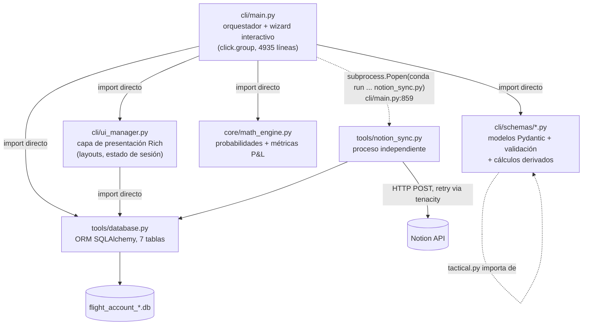
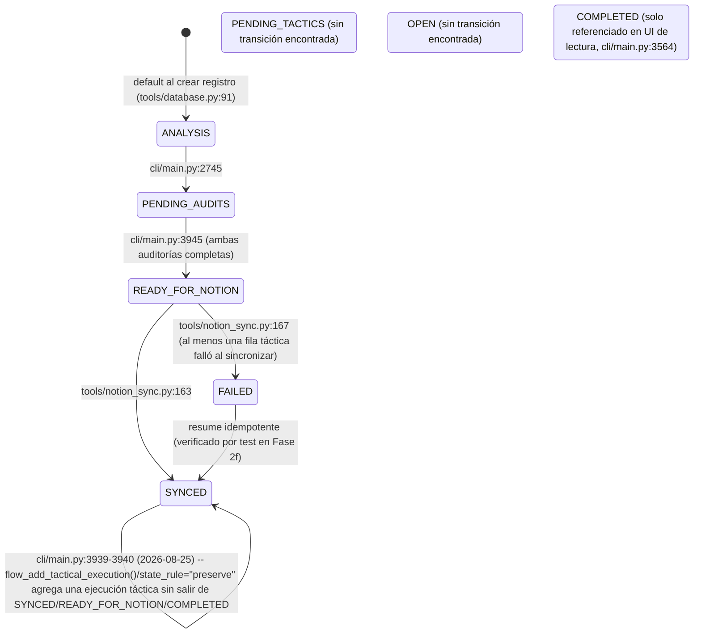

# ARCHITECTURE.md — blast_master

> Generado en Fase 3 de un research de arquitectura de 3 fases (Fase 1: identidad de repo, Fase 2: verificación de 6 claims, Fase 3: este documento). Cada hallazgo no trivial lleva `[VERIFICADO]` (con comando/línea citada) o `[NO VERIFICADO — hipótesis]`. Ver historial de conversación para el output crudo de cada comando — aquí se cita la conclusión y la ubicación, no se repite el output completo.

## 1. Resumen ejecutivo

**Qué es:** `blast_master` (B.L.A.S.T) es un CLI interactivo de trading journal (Python + Click + Rich) para registrar, auditar y sincronizar operaciones de trading contra Notion. Opera sobre múltiples cuentas/activos, cada una con su propia base de datos SQLite (`flight_account_{cuenta}_{activo}.db`), y calcula un "edge" direccional (`calc_edge`) que alimenta un modelo de probabilidades (long/short/no-trade).

**Identidad de repo resuelta (Fase 1):** de las 3 descripciones previas incompatibles (A: esquema plano single-DB con `risk_tier`; B: multi-DB por cuenta con campos `gates_failed`/`entry_time`/etc.; C: esquema normalizado de 7 tablas), la evidencia real es **"A muerta, B+C conviven"**: `risk_tier` tiene 0 ocurrencias en todo el código `[VERIFICADO]`; el nombrado multi-DB de (B) y el esquema de 7 tablas de (C) son ambos ciertos simultáneamente sobre el mismo objeto — (B) describe la capa de nombrado de archivo, (C) describe el esquema interno de tablas.

**Hallazgos clave verificados (detalle completo en §9):**
- La fórmula del "edge score" (`i_cd`) está duplicada carácter-por-carácter en **3 sitios** de `cli/main.py` (no 2, no 4) — uno de ellos autoetiquetado `# Defect 3` en su propio comentario.
- Un notebook (`jupyter/iterations.ipynb`) ejecutó un `DROP TABLE` destructivo sobre la DB de producción el 27-jul-2026 (mismo commit que "Fase 9: reestructuración tras haber borrado la base de datos"); la reinyección del backup falló por un placeholder sin reemplazar. Comparación de conteos contra el backup pre-incidente no muestra pérdida neta de filas, pero no se hizo diff fila-por-fila.
- Dos clases ORM (`AssetBalance`, `EmotionCatalog`) están definidas y no se usan en ningún otro punto del código.
- Existe una ruta hardcodeada developer-specific (`/mnt/c/Users/jcifu/Downloads`) en `cli/main.py:484`.
- 3 de los 8 estados declarados en `LifecycleState` no tienen transición de escritura confirmada en el código.
- Variables de entorno reales usadas por el motor de probabilidades (`ICD_NO_TRADE_MAX/MIN`, `ICD_EDGE_CAP`) no están documentadas en `.env.template`; una variable sí documentada (`TACTICAL_SCALING_FACTOR`) no se lee en ningún sitio.

## 2. Visión general de la arquitectura



`[VERIFICADO]` La dependencia es unidireccional: `cli/main.py:50` importa `cli.ui_manager`; `cli/ui_manager.py` (líneas 1-15) no importa `cli.main` ni `cli.schemas`, solo `tools.database` y `rich`. `cli/main.py:859` invoca `tools/notion_sync.py` como **proceso de sistema operativo separado** (`subprocess.Popen(["conda","run","-n","blast_master","env","PYTHONPATH=.","python","tools/notion_sync.py"], env=env_context)`), no como import de Python — es decir, el sync a Notion no corre en el mismo proceso que el wizard.

**Corrección respecto al esquema propuesto originalmente** (`cli/main.py → cli/ui_manager.py → cli/schemas/*.py → tools/database.py → tools/notion_sync.py` como cadena lineal): la evidencia muestra un patrón hub-and-spoke, no una cadena — `cli/main.py` importa directamente los 4 módulos (`ui_manager`, `schemas`, `math_engine`, `database`), y `ui_manager` importa `database` de forma independiente, no a través de `schemas`.

## 3. Estructura de directorios

```
blast_master/
├── cli/                        CLI principal (Click + Rich)
│   ├── main.py                 Entrypoint, wizard interactivo, todos los flows (4935 líneas)
│   ├── ui_manager.py            Layouts Rich, estado de sesión (CLIState), tablas de progreso
│   └── schemas/                 Modelos Pydantic (validación + cálculos derivados)
│       ├── efficiency.py        Direction/Strength enums, EfficiencyAnalysis
│       ├── tactical.py          Hierarchy/Timeframe enums, TacticalAnalysis
│       ├── audit_efficiency.py  Enums de auditoría de eficiencia, EfficiencyAudit
│       └── audit_tactical.py    16 enums de auditoría táctica (incl. TierSetup), TacticalAudit
├── core/
│   └── math_engine.py           calculate_probabilities, calculate_algebraic_metrics
├── tools/
│   ├── database.py              ORM SQLAlchemy: LifecycleState + 7 tablas + helpers
│   ├── notion_sync.py           Sync a Notion (proceso separado), payloads + retry
│   ├── notion_handshake.py      Script standalone de diagnóstico de conexión (sin uso por otros .py)
│   ├── migrate_keff_v2.py       Script de migración manual (recalcula probabilidades)
│   ├── migrate_tactical_legacy.py  Script de migración manual (backfill gates_failed)
│   └── migrate_tactical_audit_1n.py  Script de migración manual (nuevo, sin trackear en git al 2026-08-25) — reconstruye `tactical_audit` para el cambio 1:1→1:many (ver §5). NO ejecutado todavía contra ninguna DB real.
├── jupyter/
│   ├── iterations.ipynb         Contiene el DDL destructivo verificado en Fase 2c
│   └── data_analysis.ipynb      Sin hallazgos relevantes verificados
├── tests/                       Suite pytest (9 archivos, incl. test_notion_sync.py)
├── scratch/                     Scripts/tests exploratorios no productivos (incl. test_sync_idempotency.py)
├── .data/                       DBs reales (gitignored, no versionadas — ver Fase 1)
├── .env.template                Plantilla de variables de entorno (ver §8, incompleta)
├── requirements.txt              Dependencias (ver §7)
├── gemini.md                     Documentación previa — confirmada obsoleta en Fase 1, no editada en esta tarea
├── task_plan.md / findings.md / progress.md / tests.md   Scaffolding de un esfuerzo B.L.A.S.T. anterior, en su mayoría vacíos, sin relación con el esquema de este documento
└── rewrite_main.py / fix_legacy.py / fix_nb.py / scratch_script.py / test_table.py  Scripts sueltos en la raíz, sin explorar en este research
```

`[NO VERIFICADO — hipótesis]` El propósito exacto de `rewrite_main.py`, `fix_legacy.py`, `fix_nb.py`, `scratch_script.py` y `test_table.py` no se investigó en Fase 1/2 — `rewrite_main.py` apareció en los greps de Fase 2 (contiene lógica de gates casi idéntica a `cli/main.py`, posible fork/borrador), el resto no se abrió.

## 4. Documentación módulo por módulo

### `cli/main.py` (4935 líneas) — orquestador principal
- `cli()` — `cli/main.py:797` — `@click.group()`, entrypoint real (`if __name__=="__main__": cli()` en `cli/main.py:4935`). Ejecuta `get_active_engine()` incondicionalmente en su callback.
- `get_active_engine()` — `cli/main.py:251` — resuelve el engine SQLAlchemy activo; contiene el guard de migración `journal.db → flight_account_001_xauusd.db` en `cli/main.py:263-268` (hardcodeado a esa cuenta específica, ver §9).
- `FlightSessionManager` — `cli/main.py:288` — gestiona sesiones por cuenta en un JSON (`FLIGHT_SESSIONS_FILE`); `create_session()` construye el nombre de DB con el patrón `flight_account_{account_index}_{sanitized_nickname}.db`.
- `AuditSession` — `cli/main.py:96`, `AnalysisSession` — `cli/main.py:200` — estado de wizard en memoria.
- `determine_market_bias(i_cd)` — `cli/main.py:620` — clasifica `i_cd` en Bullish/Bearish/Choppy.
- `flow_flight_sessions()` — `cli/main.py:700` — selección/creación de cuenta al arrancar.
- `start()` — `cli/main.py:802` — `@cli.command()`, menú principal.
- `flow_review_analysis()` — `cli/main.py:935` — revisión de análisis existentes.
- `flow_new_analysis()` — `cli/main.py:2346` — wizard de nueva operación. Al terminar de guardar (`:2808-2832`, actualización 2026-08-25) pregunta si se quiere alimentar un Tactical Audit de una vez, saltando directo a `flow_pending_audits()` con parámetros `preselected_*`.
- `flow_pending_audits()` — `cli/main.py:2948` — wizard de auditorías pendientes. Actualización 2026-08-25: ganó `preselected_trade_id`/`preselected_payload`/`preselected_choice`/`state_rule`/`force_new_tactical` para que tanto el prompt de `flow_new_analysis()` como `flow_add_tactical_execution()` puedan reusarlo sin pasar por el picker de `PENDING_AUDITS`; `state_rule="preserve"` evita degradar un registro que ya llegó a `READY_FOR_NOTION`/`SYNCED`/`COMPLETED`.
- `flow_add_tactical_execution()` — `cli/main.py:3954` — **nueva (2026-08-25)**, opción "7" del menú principal (`cli/ui_manager.py:213`). Agrega una ejecución táctica a cualquier análisis pasado, sin importar su estado actual.
- `render_final_review_layout()` — `cli/main.py:4025`.
- `flow_assets_configuration()` — `cli/main.py:4334`, `flow_add_whitelisted_asset()` — `cli/main.py:4403`.
- `flow_repair_analysis_audits()` — `cli/main.py:4432` — actualización 2026-08-25: si el análisis tiene 2+ filas `tactical_audit`, pregunta cuál ejecución reparar (`:4521-4533`) antes de mostrar el menú de edición.

`[NO VERIFICADO — hipótesis]` Los números de línea de este documento fueron verificados en la fecha de cada actualización citada; el resto de la sección (fórmula `i_cd` duplicada en 3 sitios, `cli()`/`get_active_engine()`/etc.) no se re-verificó al escribir esta actualización — el archivo creció de 4935 a 5954 líneas desde la última pasada de verificación completa, así que cualquier línea sin fecha de actualización explícita puede haber corrido.

### `cli/ui_manager.py` — capa de presentación
- `CLIState` — `cli/main.py` → `cli/ui_manager.py:143` — estado de UI persistente.
- `build_persistent_layout()` — `:166`, `render_wizard_layout()` — `:403`, `render_pending_audits_table()` — `:340`.
- `get_latest_analysis_record()` — `:364`, `has_paused_state()` — `:26`, `check_daemon_status()` — `:124`.
- Depende únicamente de `tools.database` (import directo, línea 15) — no de `cli.schemas` ni `core.math_engine`.

### `cli/schemas/efficiency.py`
- `Direction(str, Enum)` — `:5` (`LONG`/`SHORT`/`NEUTRAL`), `Strength(str, Enum)` — `:10` (`STRONG`/`MID`/`WEAK`).
- `AnalysisLayerInput(BaseModel)` — `:15`, `EfficiencyAnalysis(BaseModel)` — `:22` con `calculate_derived_fields()` — `:41` (lee `EFFICIENCY_SCALING_FACTOR`/`NO_TRADE_BASE_EXPONENT` del entorno).

### `cli/schemas/tactical.py`
- Importa `Direction`/`Strength`/`AnalysisLayerInput` de `cli.schemas.efficiency` (línea 4) — único acoplamiento cruzado entre archivos de `schemas/`.
- `TacticalAnalysis(BaseModel)` — `:43`, `calculate_derived_tactics()` — `:65` (llama a `core.math_engine.calculate_probabilities`, línea 70), `to_db_layers()` — `:77`.

### `cli/schemas/audit_efficiency.py`
- 4 enums (`StructuralBias`, `ResolutionType`, `StructuralResolution`, `FailureReason`), `EfficiencyAudit(BaseModel)` — `:35` con `calculate_audit_metrics()` — `:53`.

### `cli/schemas/audit_tactical.py` (el schema más grande — 255+ líneas)
- 16 enums, incluyendo `TierSetup(str, Enum)` — `:13` con valores reales `A, B, C, D, F, SKIP` — **sin valor "E"** (ver §9/§10).
- `TacticalAudit(BaseModel)` — `:164`, `calculate_automated_fields()` — `:255`. `[NO VERIFICADO — hipótesis]` no se leyó el cuerpo completo de esta función; es candidata a ser donde se calculan `gates_failed`/`confirmations_count` a nivel Python (en paralelo a las columnas `GENERATED ALWAYS AS VIRTUAL` que el notebook de Fase 2c intentó introducir).

### `core/math_engine.py`
- `Probabilities(NamedTuple)` — `:13`.
- `calculate_probabilities(calc_edge)` — `:18` — único punto de cálculo de probabilidades del sistema (Fase 2a). Lee `ICD_NO_TRADE_MAX`/`ICD_NO_TRADE_MIN`/`ICD_EDGE_CAP` del entorno (líneas 23-25, no documentadas en `.env.template`).
- `calculate_algebraic_metrics()` — `:62` — P&L, R:R, capital en riesgo. Comentario propio en línea 61: `# Funciones heredadas (No modificar)`.

### `tools/database.py`
- `LifecycleState(str, Enum)` — `:10` — 8 valores (ver §5/§9 para cuáles tienen transición verificada).
- `Base(DeclarativeBase)` — `:47`, y 7 clases ORM: `AssetBalance` `:51`, `EmotionCatalog` `:58`, `AssetConfig` `:63`, `AnalysisLayer` `:73`, `UnifiedDepartment` `:87`, `EfficiencyAudit` `:122`, `TacticalAudit` `:142`.
- `init_db(db_url="sqlite:///.data/flight_account_001_xauusd.db")` — `:227` — nótese el default hardcodeado a la cuenta 001, mismo patrón que el guard de migración de `cli/main.py`.
- `update_record_state()` — `:413` — único setter genérico de `LifecycleState`. Actualización 2026-08-25: ganó el parámetro `tactical_audit_id` (edita una fila táctica específica en vez de siempre insertar una nueva) — ya **no** tiene un único call site, `cli/main.py` lo invoca tanto desde `flow_pending_audits()` como (indirectamente, vía ese mismo flujo) desde `flow_new_analysis()` y `flow_add_tactical_execution()`.
- `get_records_by_state()` — `:514` — mantiene su contrato de "un payload por análisis" tras la actualización 2026-08-25: toma deliberadamente solo la fila táctica más reciente, no enumera todas las ejecuciones (documentado en su propio código). `get_assets()` — `:385`, `add_asset()` — `:390`.
- `get_tactical_audit_sync_targets()` — `:627` — **nueva (2026-08-25)**. Un dict por `(unified_department, tactical_audit)` sin `notion_page_id`, incluyendo ejecuciones agregadas a un análisis ya `SYNCED` — la usa la segunda pasada de `tools/notion_sync.py:sync_records()`.

### `tools/notion_sync.py`
- `NotionAPIError`/`RateLimitError` — `:20`/`:23`.
- `map_efficiency_payload()` — `:34`, `map_tactical_payload()` — `:58`.
- `post_to_notion()` — `:80` — con retry vía `tenacity` (verificado por test en Fase 2f).
- `sync_records()` — `:95` — actualización 2026-08-25: ahora es de **dos pasadas**, no una. Pasada 1 (`:109-180`): analises `READY_FOR_NOTION`/`FAILED` — crea la página Efficiency solo si no existe, y sincroniza cada fila `tactical_audit` sin `notion_page_id` de forma independiente; solo promueve a `SYNCED` (`:163`) si **todas** las filas quedaron sincronizadas, si no `FAILED` (`:167`). Pasada 2 (`:182-202`): usa `get_tactical_audit_sync_targets()` (`tools/database.py:627`) para sincronizar ejecuciones agregadas después a un análisis que ya estaba `SYNCED`, sin recrear ni tocar la página Efficiency.
- Bug encontrado y arreglado 2026-08-25 (preexistente, sin relación con el cambio 1:many): `map_tactical_payload()` (`:62`) pasaba `calc_edge` (columna `Numeric`, se lee como `Decimal`) directo al JSON sin convertir — cualquier sync de un Tactical Audit habría fallado con `TypeError: Object of type Decimal is not JSON serializable`. Arreglado con `safe_float()`, igual que ya hacía el payload de Efficiency. Nunca antes tuvo cobertura de test que lo detectara — `sync_records()` en sí no tenía ningún test hasta `tests/test_notion_sync_two_pass.py` (2026-08-25).
- Se ejecuta como **proceso separado** (ver §2), no como import directo desde `cli/main.py` en producción (sí se importa directamente en tests, ej. `scratch/test_sync_idempotency.py:10`).

### `tools/notion_handshake.py`
- `verify_notion_connection()` — `:8` — lee `NOTION_API_KEY`/`NOTION_DATABASE_ID`. `[VERIFICADO]` cero referencias a este archivo desde cualquier otro `.py` del proyecto — script standalone de diagnóstico manual, no integrado al flujo del CLI.

### `tools/migrate_keff_v2.py` / `tools/migrate_tactical_legacy.py`
- Scripts de migración con `main()` propio (`:98` y `:15` respectivamente), invocados manualmente (no importados por `cli/main.py`). `migrate_keff_v2.py` recalcula `long_prob`/`short_prob`/`no_trade_prob` reutilizando `core.math_engine.calculate_probabilities` (comentario explícito: "Fuente única de verdad").

## 5. Modelo de datos

### Diagrama ER (7 tablas reales, confirmado por `.schema` en Fase 1)

> **Actualización 2026-08-12 (retiro de `compliance`/`trade_status`):** `unified_department.trade_status` y `tactical_audit.compliance` fueron eliminados de las 3 DBs de cuenta (DROP COLUMN, con backup previo) y del código. Ambos eran señales de ejecución redundantes/potencialmente divergentes de la realidad (`trade_status` era informativo puro sin uso analítico; `compliance` alimentaba el motor de KPIs pero mezclaba "¿se llenó la orden?" con un juicio subjetivo de calidad de ejecución). `tactical_audit.order_filled` (booleano) es ahora la única señal de ejecución, derivada al momento de guardar la auditoría táctica y usada como gate binario en `core/analytics_engine.py:filter_executed_trades` y `core/backtest_engine.py:reconstruct_execution_outcome` (este último usa el signo de `r_multiple`, no una etiqueta manual, para el acierto direccional). `efficiency_audit.specific_bias_compliance` no fue tocado — sigue siendo un campo distinto (validez del sesgo estructural, no de ejecución).

> **Actualización 2026-08-25 (`tactical_audit` 1:1 → 1:many) — CÓDIGO SIN COMMITEAR, MIGRACIÓN YA APLICADA A LAS 3 DBs REALES.** `TacticalAudit.id` dejó de ser la PK compartida con `unified_department.id` (`tools/database.py:159`, antes `ForeignKey(..., primary_key=True)`) y pasó a ser un UUID propio; el vínculo con el análisis ahora es `trade_id` (`:160`, FK normal no-única, mismo patrón que `AnalysisLayer.trade_id`), permitiendo varias ejecuciones reales por análisis (escalar el mismo edge, retomarlo días después) sin crear un nuevo Unified Analysis cada vez. `efficiency_audit` no se tocó — sigue 1:1. Nuevas columnas en `TacticalAudit`: `created_at`/`updated_at`/`notion_page_id` (`:161-163`); `UnifiedDepartment.tactical_page_id` se eliminó (su valor se traslada al `notion_page_id` de la primera fila durante la migración). El diagrama ER de abajo ya refleja el esquema nuevo — las 3 DBs reales (`.data/flight_account_*.db`) ya lo tienen aplicado con autorización explícita del usuario (`tools/migrate_tactical_audit_1n.py --confirm --i-understand-this-is-production`, verificado: conteos sin cambio, 0 filas con `trade_id` huérfano en las 3 cuentas). Backup previo: snapshot manual por `VACUUM INTO` en `.data/archives/pre_tactical_audit_1n_<cuenta>_20260825_085521.db` (`tools/backup.py` no se pudo usar — sin USB montado ni credenciales B2 en este entorno). Detalle completo (CLI, Notion sync de dos pasadas, `report_data.py`, tests, notebooks) en "Antes de tocar código en este repo" de `CLAUDE.md`; diseño original en `/home/jorgecg/.claude/plans/actualmente-quiero-que-hagamos-robust-giraffe.md`. **El código sigue sin commitear a git** — la migración de datos ya corrió, pero eso es independiente de si el código que la acompaña está integrado a la rama principal.

```mermaid
erDiagram
    UNIFIED_DEPARTMENT ||--o{ ANALYSIS_LAYER : "trade_id → id, CASCADE"
    UNIFIED_DEPARTMENT ||--o| EFFICIENCY_AUDIT : "id → id (PK compartida), CASCADE"
    UNIFIED_DEPARTMENT ||--o{ TACTICAL_AUDIT : "trade_id → id, CASCADE"

    UNIFIED_DEPARTMENT {
        varchar id PK
        varchar state
        varchar asset
        float calc_edge
        float long_prob
        float short_prob
        float no_trade_prob
    }
    ANALYSIS_LAYER {
        varchar id PK
        varchar trade_id FK
        varchar layer_name
        varchar direction
        int score
    }
    EFFICIENCY_AUDIT {
        varchar id PK_FK
        varchar bias_a
        varchar real_bias_b
        varchar resolution_type
    }
    TACTICAL_AUDIT {
        varchar id PK
        varchar trade_id FK
        datetime created_at
        datetime updated_at
        varchar notion_page_id
        varchar tier_setup
        boolean order_filled
        int gates_failed
        int confirmations_count
        datetime entry_time
        float entry_price
        float closing_price
        varchar setup_type
    }
    ASSET_CONFIG {
        int id PK
        varchar asset_name
        varchar code
    }
    ASSET_BALANCE {
        varchar asset_code PK
    }
    EMOTION_CATALOG {
        int emotion_id PK
    }
```

`[VERIFICADO]` `ASSET_CONFIG`, `ASSET_BALANCE` y `EMOTION_CATALOG` **no tienen FK hacia `UNIFIED_DEPARTMENT`** en el `.schema` real — son tablas standalone. `ASSET_BALANCE`/`EMOTION_CATALOG` además no tienen ninguna clase ORM referenciada fuera de su propia definición (Fase 2d) — probablemente vestigiales. `ASSET_CONFIG` sí se usa activamente vía `get_assets()`/`add_asset()` (whitelist de activos).

### Diagrama de estados — `LifecycleState`



`[VERIFICADO]` Solo 5 de los 8 valores declarados (`ANALYSIS`, `PENDING_AUDITS`, `READY_FOR_NOTION`, `SYNCED`, `FAILED`) tienen un punto de escritura real localizado por grep dirigido (`LifecycleState.X.value` y comparación de string literal). `[NO VERIFICADO — hipótesis]` `PENDING_TACTICS`/`OPEN`/`COMPLETED` podrían asignarse dinámicamente (construcción de string no cubierta por el patrón de grep usado) — no se puede afirmar con certeza que sean código muerto, solo que no se encontró evidencia de asignación.

## 6. Flujo de datos end-to-end

1. Usuario arranca `cli()` → `get_active_engine()` resuelve/crea la DB de la sesión activa (`FlightSessionManager`).
2. `flow_new_analysis()` (`cli/main.py:2346`) recolecta inputs direccionales (`p0`...`p4`) → calcula `i_cd` in-line (fórmula duplicada, sitio #1 o #2 según el punto del wizard) → `determine_market_bias(i_cd)` + `core.math_engine.calculate_probabilities(i_cd)`.
3. Los datos se validan/enriquecen vía `cli/schemas/tactical.py` (`TacticalAnalysis.calculate_derived_tactics()`, que **sí** reutiliza `calculate_probabilities` como función compartida, a diferencia del cálculo de `i_cd`) y `cli/schemas/efficiency.py`.
4. Persistencia inicial vía `tools/database.py`: se crea `UnifiedDepartment` (estado inicial `ANALYSIS`, transiciona a `PENDING_AUDITS` en el mismo flujo) + filas `AnalysisLayer` asociadas.
5. **Actualización 2026-08-25:** justo después de guardar, `flow_new_analysis()` pregunta si se quiere alimentar un Tactical Audit de una vez (`:2808-2832`) — si el usuario acepta, salta directo al paso 6 para ese mismo registro sin volver al menú.
6. `flow_pending_audits()` (`cli/main.py:2948`) recolecta las auditorías de eficiencia/táctica (`EfficiencyAudit`/`TacticalAudit`, con su propio recálculo de `i_cd` — sitio #3, `recalculate_unified_metrics`) → al completarse ambas, `update_record_state()` promueve `PENDING_AUDITS → READY_FOR_NOTION`. Desde 2026-08-25, `tactical_audit` es 1:many (ver §5) — este mismo flujo, reinvocado más tarde vía la nueva `flow_add_tactical_execution()` (`:3954`) sobre un análisis que ya llegó a `READY_FOR_NOTION`/`SYNCED`/`COMPLETED`, agrega una ejecución adicional sin degradar ese estado (`state_rule="preserve"`).
7. El usuario (u otro disparador manual) invoca la sincronización → `cli/main.py:859` lanza `tools/notion_sync.py` como **proceso de sistema operativo separado** (`subprocess.Popen`), no una llamada de función in-process.
8. `sync_records()` (actualización 2026-08-25: dos pasadas, ver §4) lee registros en `READY_FOR_NOTION`/`FAILED`, arma payloads (`map_efficiency_payload`/`map_tactical_payload`) y hace `POST` a la API de Notion (`post_to_notion`, con retry vía `tenacity`) una vez por cada fila `tactical_audit` sin sincronizar → estado final `SYNCED` o `FAILED` (con posibilidad de resume idempotente, verificado en Fase 2f). Una segunda pasada cubre ejecuciones agregadas después a un análisis ya `SYNCED` (paso 6), sin reabrir ni recrear su página Efficiency.

`[VERIFICADO]` cada paso cita archivo:línea arriba (pasos 1-4, 7 re-verificados solo donde el número de línea cambió; pasos 5-6-8 verificados en la actualización 2026-08-25). `[NO VERIFICADO — hipótesis]` qué dispara el paso 7 en la práctica (¿comando manual del usuario, cron, o botón en el wizard?) — no se rastreó el disparador exacto de esa línea de `subprocess.Popen`.

## 7. Dependencias externas

| Paquete | Versión | Uso real verificado |
|---|---|---|
| `requests` | 2.31.0 | HTTP a Notion API (`tools/notion_sync.py`, `tools/notion_handshake.py`) `[VERIFICADO]` |
| `rich` | 13.7.1 | Toda la capa de presentación (`Panel`/`Table`/`Layout`/`Console`) en `cli/main.py` y `cli/ui_manager.py` `[VERIFICADO]` |
| `python-dotenv` | 1.0.1 | `load_dotenv()` en `core/math_engine.py:9` `[VERIFICADO]` |
| `pydantic` | 2.6.3 | `BaseModel` en los 4 archivos de `cli/schemas/` `[VERIFICADO]` |
| `pytest` | 8.0.2 | Suite `tests/` (9 archivos) `[VERIFICADO]` |
| `sqlalchemy` | 2.0.27 | ORM completo, `tools/database.py` `[VERIFICADO]` |
| `click` | 8.1.7 | `@click.group()`/`@cli.command()`, `cli/main.py` `[VERIFICADO]` |
| `tenacity` | 8.2.3 | Retry de `post_to_notion` (`tools/notion_sync.py`), probado en `tests/test_notion_sync.py:test_rate_limit_backoff` `[VERIFICADO]` |
| `requests-mock` | 1.11.0 | Mocking HTTP en `tests/test_notion_sync.py` y `scratch/test_sync_idempotency.py` `[VERIFICADO]` |
| `InquirerPy` | 0.3.4 | Prompts interactivos, usado en `cli/main.py` (y `scratch/test_keys.py`, `scratch/test_c_r.py`) `[VERIFICADO]` |

## 8. Configuración y variables de entorno

| Variable | Declarada en `.env.template` | Leída en código | Estado |
|---|---|---|---|
| `NOTION_API_KEY` | Sí | `tools/notion_handshake.py:11`, `tools/notion_sync.py:10` | `[VERIFICADO]` OK |
| `NOTION_DATABASE_ID` | Sí | `tools/notion_handshake.py:12`; fallback en `tools/notion_sync.py:11-12` | `[VERIFICADO]` OK |
| `EFFICIENCY_SCALING_FACTOR` | Sí (`0.2833`) | `cli/schemas/efficiency.py:45` | `[VERIFICADO]` OK |
| `NO_TRADE_BASE_EXPONENT` | Sí (`1.54`) | `cli/schemas/efficiency.py:46` | `[VERIFICADO]` OK |
| `TACTICAL_SCALING_FACTOR` | Sí | **0 ocurrencias en `os.getenv`/`os.environ` en todo el árbol `.py`** | `[VERIFICADO]` variable muerta — declarada, nunca leída |
| `ICD_NO_TRADE_MAX` | **No** | `core/math_engine.py:23` (default fallback `0.8000`) | `[VERIFICADO]` indocumentada — calibra el modelo de probabilidades real |
| `ICD_NO_TRADE_MIN` | **No** | `core/math_engine.py:24` (default fallback `0.5000`) | `[VERIFICADO]` indocumentada |
| `ICD_EDGE_CAP` | **No** | `core/math_engine.py:25` (default fallback `1.0000`) | `[VERIFICADO]` indocumentada |
| `EFFICIENCY_DB_ID` | **No** | `tools/notion_sync.py:11` (fallback a `NOTION_DATABASE_ID`) | `[VERIFICADO]` indocumentada |
| `TACTICAL_DB_ID` | **No** | `tools/notion_sync.py:12` (fallback a `NOTION_DATABASE_ID`) | `[VERIFICADO]` indocumentada |

## 9. Hallazgos arquitectónicos y deuda técnica

### Los 6 claims de Fase 2 (aprobados, con correcciones incorporadas)

**(a) ¿2 modelos de probabilidad distintos?** `[VERIFICADO]` — **Refutado.** Solo existe 1: `core/math_engine.py:18 calculate_probabilities()`. Se persiste su único resultado vía `tools/database.py:109-111`. Llamado consistentemente desde `cli/schemas/tactical.py:70`, `cli/main.py:2103`, `cli/main.py:3982`, `tools/migrate_keff_v2.py:138`.

**(b) ¿Fórmula del Edge Score duplicada, en cuántos sitios?** `[VERIFICADO]` — **3 sitios exactos** (no 2, no 4): `cli/main.py:2091-2100`, `cli/main.py:2187-2196`, `cli/main.py:3963-3972`. El tercero es una variante (comparación por strings literales en vez de enums) autoetiquetada `# Multi-Layer Recalculation Pipeline (Defect 3)` en su propio comentario (línea 3961).

**(c) ¿DDL destructivo sin ejecutar?** `[VERIFICADO]` — **Al revés de la premisa: sí se ejecutó.** `jupyter/iterations.ipynb` celda índice 3 (`execution_count=6`) ejecutó `DROP TABLE IF EXISTS tactical_audit` + `CREATE TABLE` con columnas `GENERATED ALWAYS AS VIRTUAL` y `CHECK` constraint contra la ruta absoluta de producción — con éxito (stdout confirmado). La reinyección posterior de datos de backup falló (`ValueError: Expected object or value`, placeholder JSON nunca reemplazado). Correlación temporal exacta (mismo segundo) con el commit `c60e32c` ("Fase 9... tras haber borrado la base de datos", 2026-07-27 12:01:54). Comparación de conteos backup pre-incidente (18-jul: `tactical_audit`=36, `unified_department`=37) vs. actual (58/58) **no muestra pérdida neta** — criterio de cierre acordado con el usuario, sin diff fila-por-fila por clave de negocio (limitación anotada explícitamente, no resuelta).

> **Actualización de estado (08-ago-2026):** la celda con `DROP TABLE IF EXISTS tactical_audit` fue eliminada de `jupyter/iterations.ipynb` (verificado por diff: 157 líneas removidas, 0 agregadas — borrado limpio de la celda, no una edición). El hallazgo forense de arriba se conserva sin cambios como registro histórico del incidente; esta nota solo documenta que el riesgo de re-ejecución ya no existe en el árbol de trabajo actual.

**(d) ¿Tablas ORM sin uso?** `[VERIFICADO]` — `AssetBalance` (`tools/database.py:51`) y `EmotionCatalog` (`tools/database.py:58`): cero referencias fuera de su propia definición en todo el árbol `.py`.

**(e) ¿Ruta hardcodeada developer-specific?** `[VERIFICADO]` — `cli/main.py:484`: `Path("/mnt/c/Users/jcifu/Downloads")`. Adicional: `jupyter/iterations.ipynb` también hardcodea la ruta absoluta completa del repo (fuera del alcance del grep `.py` original).

**(f) Diff scratch/test_sync_idempotency.py vs tests/test_notion_sync.py** `[VERIFICADO]` — Cero solapamiento. `tests/test_notion_sync.py`: 2 tests unitarios sobre `post_to_notion` (rate-limit backoff, POST exitoso). `scratch/test_sync_idempotency.py`: 1 test de integración (DB en memoria) que cubre fallo parcial + resume idempotente de `sync_records()`.

### Hallazgos adicionales surgidos durante la redacción de Fase 3

*(No pasaron por el gate de aprobación de Fase 2 — presentados aquí para tu revisión, no como conclusiones ya aprobadas.)*

**(g) Estados de `LifecycleState` sin transición verificada.** `[VERIFICADO el patrón de no-uso vía grep dirigido]` — 3 de 8 valores (`PENDING_TACTICS`, `OPEN`, `COMPLETED`) declarados en `tools/database.py:10-17` sin punto de escritura confirmado. `COMPLETED` aparece en una condición de estilo de solo-lectura (`cli/main.py:3564`). `[NO VERIFICADO — hipótesis]` que sea código muerto — el grep no cubre construcción dinámica de strings.

**(h) Variables de entorno indocumentadas o muertas.** `[VERIFICADO]` — ver tabla completa en §8. `TACTICAL_SCALING_FACTOR` se declara y no se lee; `ICD_NO_TRADE_MAX`/`ICD_NO_TRADE_MIN`/`ICD_EDGE_CAP` (las constantes reales del modelo de probabilidades) y `EFFICIENCY_DB_ID`/`TACTICAL_DB_ID` se leen y no se declaran.

**(i) `TierSetup` real es A-D+F, no A-F.** `[VERIFICADO]` — `cli/schemas/audit_tactical.py:13-19`: valores `A, B, C, D, F, SKIP`. No existe nivel "E" — corrige la descripción previa que asumía un rango continuo "A-F".

**(j) `tools/notion_handshake.py` no está integrado al flujo del CLI.** `[VERIFICADO]` — cero referencias desde cualquier otro `.py` del proyecto. Script standalone de diagnóstico manual.

## 10. Glosario de dominio

- **`I_CD` / Edge Score / `calc_edge`** — Promedio ponderado de 5 señales direccionales (`x0`...`x4`, pesos `0.30/0.25/0.15/0.10/0.20`, dividido entre 2) que representa la ventaja/sesgo direccional estimado de una operación. Determina `market_bias` (Bullish/Bearish/Choppy) y alimenta `calculate_probabilities`. `[VERIFICADO]` fórmula duplicada en 3 sitios, ver §9(b).
- **Gates / Confirmations (`gates_failed`/`confirmations_count`)** — Checklist pre-trade: 7 "gates" (`g1_trend_15m`...`g7_tp_validated`) son condiciones obligatorias; 8 "confirmations" (`c1_kl_support`...`c8_convergence_15m`) son señales de confluencia opcionales. `[VERIFICADO]` columnas confirmadas en el `.schema` real (Fase 1). `[NO VERIFICADO — hipótesis]` el mecanismo exacto de cálculo en Python (candidato: `cli/schemas/audit_tactical.py:255 calculate_automated_fields`) no se leyó línea por línea.
- **Tier Setup** — Clasificación de calidad de un setup de trading. Valores reales: `A, B, C, D, F, SKIP` (`cli/schemas/audit_tactical.py:13`) — sin nivel "E". `[VERIFICADO]`.
- **Flight Session** — Unidad de sesión operativa por cuenta, gestionada por `FlightSessionManager` (`cli/main.py:288`), que crea/nombra un archivo `.db` independiente por cuenta con el patrón `flight_account_{account_index}_{sanitized_nickname}.db`. `[VERIFICADO]`.
- **`LifecycleState`** — Máquina de estados del ciclo de vida de un trade (8 valores declarados, `tools/database.py:10-17`). Ver §5 para el diagrama y qué transiciones tienen evidencia real de escritura.
